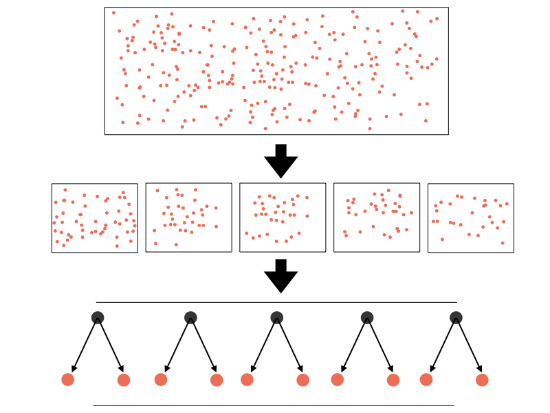

# Bagging and Random Forest

In this module, we introduce the concept of [*bagging*](https://en.wikipedia.org/wiki/Bootstrap_aggregating), which is shorthand for bootstrap aggregation, where random samples of the data are used to construct multiple decision trees. Since each tree only sees part of the data, each tree is less accurate than if it had been constructed over the full data set. Thus, each tree is known as a *weak learner*. A more powerful, meta-estimator is subsequently constructed by averaging over these many weak learners. The approach of constructing weak learners, and combining them into a more powerful estimator, is at the heart of several, very powerful machine learning techniques, including the [random forest](https://en.wikipedia.org/wiki/Random_forest).

We first introduce the formalism behind bagging, including a discussion of the concept of bootstrapping. Next, we move on to a discussion of the random forest algorithm, which will include its application to both classification and regression tasks.

# Formalism

One of the simplest machine learning algorithms to understand is the decision tree. Often, a decision tree is made as large as possible to provide the best predictive model, as this produces a high purity in the leaf nodes. Doing so, however, can lead to overfitting where the model predicts very accurately on the training data but fails to generalize to the test data; the accuracy is, as a result, much lower.

A simple approach to overcoming the overfitting problem is to train many decision trees on a subset of the data and to average the resulting predictions. This process is known as bootstrap aggregation, which is often shortened to bagging. Of these two terms, aggregation is simple to understand, one simply aggregates (or averages) the predictions of the many trees.

The term bootstrap is a statistical term that defines how a sample can be constructed from an original data set. Given a data set, there are two simple ways to construct a new sample. As a specific example, consider building a list of shows you wish to watch from an online provider like Netflix or Amazon by placing them in a virtual cart. In the first approach, you take a show of the virtual shelf and place it in your cart. This is known as sampling without replacement since the show is only present in your cart. In the second approach, you take a show and place it in your cart, but there remains a copy of the show on the virtual shelf. This is known as sampling with replacement, since we replace the original instance.

Sampling with replacement has several advantages that make it important for machine learning. First, we can construct many large samples from our original data set, where each sample is not limited by the size of the original data set. For example, if our original data set contained 100 entries, sampling without replacement would mean we could only create ten new samples that each had ten entries. On the other hand, sampling with replacement means we could create 100 (or more) new samples that each have ten (or more) entries.

Building many samples from a parent population allows us to build an estimator on each sample and average (or aggregate) the results. This is demonstrated in the following figure, where an original data set is used to train a number of decision trees. In this case, each tree is constructed from a bootstrap sample of the original data set. The predictions from these trees are aggregated at the end to make a final prediction.

{width="100%"}

Beyond improved prediction, bagging algorithms provide an additional benefit. Since each tree (or other learning algorithm in the case of a *Bagging* estimator) is constructed from a subsample of the original data, the performance of that tree can be tested on the data from the original data that were not used in its construction. These data are known as out-of-bag data, and provide a useful metric for the performance of each individual tree used in the ensemble.

Before introducing the random forest, we first explore the construction and use of bootstrap samples.

## **Bootstrap**

Formally, a bootstrap refers to any statistical process that relies on the generation of random samples with replacement. To demonstrate the benefit of the bootstrap, we will bootstrap the `size` feature from the *tips* data set, which is the number of patrons served by the restaurant for a meal.

**Bootstrapping** is a method that can be used to estimate the standard error of any [statistic](https://www.statology.org/statistic-vs-parameter/) and produce a [confidence interval](https://www.statology.org/confidence-intervals/) for the statistic.

The basic process for bootstrapping is as follows:

-   Take *k* repeated samples with replacement from a given dataset.
-   For each sample, calculate the statistic you're interested in.
-   This results in *k* different estimates for a given statistic, which you can then use to calculate the standard error of the statistic and create a confidence interval for the statistic.

We can use the rsample package:

```{r boot, eval=FALSE}
install.packages("rsample")
```

The initial power of the bootstrap results from our ability to extend the creation of this one sample to many.

```{r boot2}
library(curl)

load(curl("https://raw.githubusercontent.com/Professor-Hunt/ACC8143/main/data/tips.rda"))


set.seed(0)
library(rsample)
library(tidyverse)

#perform bootstrapping with 2000 replications
resample1 <- bootstraps(as.data.frame(tips$size), times = 100)

#view results of boostrapping
knitr::kable(head(summary(resample1),5))

#info for a specific sample
resample1$splits[[1]]
#mean
mean(resample1$splits[[1]]$data$`tips$size`)
#standard deviation
sd(resample1$splits[[1]]$data$`tips$size`)

```

Of course, we do not need to compute these statistics across the entire sample, we can compute the mean for each sample, creating an array of means. In this case, we can consider each sample mean to be an estimate of the mean of the parent population. We can average these means (i.e., aggregate) these sample means to provide an estimate of the population mean, along with a measure of the uncertainty in this estimate, by computing the standard deviation of our sample means.

```{r boot3}
#get all of them 
mean_values<-purrr::map_dbl(resample1$splits,
        function(x) {
          dat <- as.data.frame(x)$`tips$size`
          mean(dat)
        })

#view the whole dataset
knitr::kable(mean_values)%>%
  kableExtra::kable_styling("striped")%>%
  kableExtra::scroll_box(width = "50%",height="300px")

#estimate of the population mean
mean(mean_values)

#get all of them
sd_values<-purrr::map_dbl(resample1$splits,
        function(x) {
          dat <- as.data.frame(x)$`tips$size`
          sd(dat)
        })

#view the whole dataset
knitr::kable(sd_values)%>%
  kableExtra::kable_styling("striped")%>%
  kableExtra::scroll_box(width = "50%",height="300px")

#estimate of the population standard deviation
sd(sd_values)


```

This simple example has demonstrated how bootstrap aggregation, in this case of the sample means, can provide a powerful estimator of a population statistic. In each case, we generate multiple samples with replacement, compute statistics across these samples, and aggregate the result at the end. This concept underlies all bagging estimators.

# Exercise 1

1.  Redo the bootstrap analysis, but use 10 samples. Change `times = 100` to `times = 10`. How does the population estimate for mean change?
2.  Redo the bootstrap analysis, but find the median. What is the difference in population estimate for the median vs mean?

# Random Forest

A [random forest](https://en.wikipedia.org/wiki/Random_forest) employs bagging to create a set of decision trees from a given data set. Each tree is constructed from a bootstrap sample, and the final prediction is generated by aggregating the predictions of the individual trees, just like the previous code example demonstrated by using the mean of the sample means to estimate the mean of the parent population. However, the random forest introduces one additional random concept into the tree construction.

Normally, when deciding on a split point during the construction of a decision tree, all features are evaluated and the one that has the highest impurity (or produces the largest information gain) is selected as the feature on which to split, along with the value at which to split that feature. In a random forest, a random subset of all features is used to make the split choice, and the best feature on which to split is selected form this subset.

This extra randomness produces individual decision trees that are less sensitive to small-scale fluctuations, which is known as under-fitting. As a result, each newly created decision tree is a weak learner since they are not constructed from all available information. Yet, since each decision tree is constructed from different sets of features, by aggregating their predictions, the final random forest prediction is improved and less affected by overfitting.

Each tree in the random forest is constructed from a different combination of features. As a result, we can use the *out-of-bag* performance from each tree to rank the importance of the features used to construct the trees in the forest. This allows for robust estimates of feature importance to be computed after constructing a random forest, which can provide useful insight into the nature of a training data set.

## **Random Forest: Classification**

Having completed the discussion on bootstrap aggregation, and introduced the random forest algorithm, we can now transition to putting this powerful ensemble algorithm to work.

```{r rf1}
set.seed(1)
#lets split the data 60/40
library(caret)
trainIndex <- createDataPartition(iris$Species, p = .6, list = FALSE, times = 1)

#grab the data
irisTrain <- iris[ trainIndex,]
irisTest  <- iris[-trainIndex,]

ggplot(data=irisTrain)+geom_point(mapping = aes(x=Petal.Length,y=Petal.Width,color=Species),alpha=0.5) + labs(color = "Training Species")+
geom_point(data=irisTest, ,mapping = aes(x=Petal.Length,y=Petal.Width,shape=Species)) + labs(shape = "Testing Species") +
  ggtitle("The data")+
  theme(plot.title = element_text(hjust=0.5, size=10, face='bold'))


```

The model

```{r rf2}
set.seed(1)

IrisRF<- train(
  form = factor(Species) ~ .,
  data = irisTrain,
  #here we add classProbs because we want probs
  trControl = trainControl(method = "cv", number = 10,
                           classProbs =  TRUE),
  method = "rf",
  tuneLength = 3)#why 3?

IrisRF

summary(IrisRF)

IrisRF_Pred<-predict(IrisRF,irisTest,type="prob")

knitr::kable(IrisRF_Pred)%>%
  kableExtra::kable_styling("striped")%>%
  kableExtra::scroll_box(width = "50%",height="300px")

irisrftestpred<-cbind(IrisRF_Pred,irisTest)

irisrftestpred<-irisrftestpred%>%
  mutate(prediction=if_else(setosa>versicolor & setosa>virginica,"setosa",
                            if_else(versicolor>setosa & versicolor>virginica, "versicolor",
                                    if_else(virginica>setosa & virginica>versicolor,"virginica", "PROBLEM"))))

table(irisrftestpred$prediction)

confusionMatrix(factor(irisrftestpred$prediction),factor(irisrftestpred$Species))
```

### **Random Forest: Feature Importance**

As the previous example demonstrated, the random forest is easy to use and often provides impressive results. In addition, by its very nature, a random forest provides an implicit measure of the importance of the individual features in generating the final predictions. While an individual decision tree provides this information, the random forest provides an aggregated result that is generally more insightful and less sensitive to fluctuations in the training data that might bias the importance values determined by a decision tree. In the calculation of feature importance from a random forest, higher values indicate a more important feature.

```{r rf3}

V<-caret::varImp(IrisRF)$importance%>%
  arrange(desc(Overall))

knitr::kable(V)

ggplot2::ggplot(V, aes(x=reorder(rownames(V),Overall), y=Overall)) +
geom_point( color="blue", size=4, alpha=0.6)+
geom_segment( aes(x=rownames(V), xend=rownames(V), y=0, yend=Overall), 
color='skyblue') +
xlab('Variable')+
ylab('Overall Importance')+
theme_light() +
coord_flip() 


```

# Exercise 2

1.  Use the tips data and predict `sex`. Use only continuous variables. What are the results?
2.  Use the tips data and predict `sex`. Use all of the variables. Did the model improve from 1?
3.  What are the most important variables from 2?

## Decision Surfaces

```{r surface1}

set.seed(1)
#lets split the data 60/40
library(caret)
trainIndex <- createDataPartition(iris$Species, p = .6, list = FALSE, times = 1)

#grab the data
train <- iris[ trainIndex,]
test  <- iris[-trainIndex,]

IrisRF<- train(
  form = factor(Species) ~ .,
  data = train,
  #here we add classProbs because we want probs
  trControl = trainControl(method = "cv", number = 10,
                           classProbs =  TRUE),
  method = "rf",
  tuneGrid=data.frame(mtry=1))


pl = seq(min(iris$Petal.Length), max(iris$Petal.Length), by=0.1)
pw = seq(min(iris$Petal.Width), max(iris$Petal.Width), by=0.1)

# generates the boundaries for your graph
lgrid <- expand.grid(Petal.Length=pl, 
                     Petal.Width=pw,
                     Sepal.Length = 5.4,
                     Sepal.Width=3.1)

IrisRFGrid2 <- predict(IrisRF, newdata=lgrid)
IrisRFGrid <- as.numeric(IrisRFGrid2)

# get the points from the test data...
testPred <- predict(IrisRF, newdata=test)
testPred <- as.numeric(testPred)
# this gets the points for the testPred...
test$Pred <- testPred

probs <- matrix(IrisRFGrid, length(pl), length(pw))

ggplot(data=lgrid) + stat_contour(aes(x=Petal.Length, y=Petal.Width, z=IrisRFGrid),bins=10) +
  geom_point(aes(x=Petal.Length, y=Petal.Width, colour=IrisRFGrid2),alpha=.2) +
  geom_point(data=test, aes(x=Petal.Length, y=Petal.Width, shape=Species), size=2) + 
  labs(shape = "Testing Species") +
  geom_point(data=train, aes(x=Petal.Length, y=Petal.Width, color=Species), size=2, alpha=0.75)+
  theme_bw()+ 
  labs(color = "Training Species")+
  ggtitle("Decision Surface mtry=1")
 

```

```{r surface2, echo=FALSE}

set.seed(1)
#lets split the data 60/40
library(caret)
trainIndex <- createDataPartition(iris$Species, p = .6, list = FALSE, times = 1)

#grab the data
train <- iris[ trainIndex,]
test  <- iris[-trainIndex,]

IrisRF<- train(
  form = factor(Species) ~ .,
  data = train,
  #here we add classProbs because we want probs
  trControl = trainControl(method = "cv", number = 10,
                           classProbs =  TRUE),
  method = "rf",
  tuneGrid=data.frame(mtry=2))#why 3?


pl = seq(min(iris$Petal.Length), max(iris$Petal.Length), by=0.1)
pw = seq(min(iris$Petal.Width), max(iris$Petal.Width), by=0.1)

# generates the boundaries for your graph
lgrid <- expand.grid(Petal.Length=pl, 
                     Petal.Width=pw,
                     Sepal.Length = 5.4,
                     Sepal.Width=3.1)

IrisRFGrid2 <- predict(IrisRF, newdata=lgrid)
IrisRFGrid <- as.numeric(IrisRFGrid2)

# get the points from the test data...
testPred <- predict(IrisRF, newdata=test)
testPred <- as.numeric(testPred)
# this gets the points for the testPred...
test$Pred <- testPred

probs <- matrix(IrisRFGrid, length(pl), length(pw))

ggplot(data=lgrid) + stat_contour(aes(x=Petal.Length, y=Petal.Width, z=IrisRFGrid),bins=10) +
  geom_point(aes(x=Petal.Length, y=Petal.Width, colour=IrisRFGrid2),alpha=.2) +
  geom_point(data=test, aes(x=Petal.Length, y=Petal.Width, shape=Species), size=2) + labs(shape = "Testing Species") +
  geom_point(data=train, aes(x=Petal.Length, y=Petal.Width, color=Species), size=2, alpha=0.75)+
  theme_bw()+ 
  labs(color = "Training Species")+
  ggtitle("Decision Surface mtry=2")#+
  #scale_color_hue(labels=c('setosa', 'versicolor', 'virginica'))

```

```{r surface3, echo=FALSE}

set.seed(1)
#lets split the data 60/40
library(caret)
trainIndex <- createDataPartition(iris$Species, p = .6, list = FALSE, times = 1)

#grab the data
train <- iris[ trainIndex,]
test  <- iris[-trainIndex,]

IrisRF<- train(
  form = factor(Species) ~ .,
  data = train,
  #here we add classProbs because we want probs
  trControl = trainControl(method = "cv", number = 10,
                           classProbs =  TRUE),
  method = "rf",
  tuneGrid=data.frame(mtry=3))#why 3?


pl = seq(min(iris$Petal.Length), max(iris$Petal.Length), by=0.1)
pw = seq(min(iris$Petal.Width), max(iris$Petal.Width), by=0.1)

# generates the boundaries for your graph
lgrid <- expand.grid(Petal.Length=pl, 
                     Petal.Width=pw,
                     Sepal.Length = 5.4,
                     Sepal.Width=3.1)

IrisRFGrid2 <- predict(IrisRF, newdata=lgrid)
IrisRFGrid <- as.numeric(IrisRFGrid2)

# get the points from the test data...
testPred <- predict(IrisRF, newdata=test)
testPred <- as.numeric(testPred)
# this gets the points for the testPred...
test$Pred <- testPred

probs <- matrix(IrisRFGrid, length(pl), length(pw))

ggplot(data=lgrid) + stat_contour(aes(x=Petal.Length, y=Petal.Width, z=IrisRFGrid),bins=10) +
  geom_point(aes(x=Petal.Length, y=Petal.Width, colour=IrisRFGrid2),alpha=.2) +
  geom_point(data=test, aes(x=Petal.Length, y=Petal.Width, shape=Species), size=2) + labs(shape = "Testing Species") +
  geom_point(data=train, aes(x=Petal.Length, y=Petal.Width, color=Species), size=2, alpha=0.75)+
  theme_bw()+ 
  labs(color = "Training Species")+
  ggtitle("Decision Surface mtry=3")#+
  #scale_color_hue(labels=c('setosa', 'versicolor', 'virginica'))
```

## **Random Forrest: Regression**

A random forest can also be used to perform regression; however, in this case the goal is to create trees whose leaf nodes contain data that are nearby in the overall feature space. To predict a continuous value from a tree we either have leaf nodes with only one feature, and use the relevant feature from that instance as our predictor, or we compute summary statistics from the instances in the appropriate leaf node, such as the mean or mode. In the end, the random forest aggregates the individual tree regression predictions into a final prediction.

```{r rf4}

set.seed(1)

IrisRF<- train(
  form = Sepal.Width ~ .,
  data = irisTrain,
  #here we add classProbs because we want probs
  trControl = trainControl(method = "cv", number = 10),
  method = "rf",
  tuneLength = 3)#why 3?

IrisRF

summary(IrisRF)

IrisRF_Pred<-predict(IrisRF,irisTest)

knitr::kable(IrisRF_Pred)%>%
  kableExtra::kable_styling("striped")%>%
  kableExtra::scroll_box(width = "50%",height="300px")

irisrftestpred<-cbind(IrisRF_Pred,irisTest)

#root mean squared error
RMSE(irisrftestpred$IrisRF_Pred,irisrftestpred$Sepal.Width)
#best measure ever...RSquared 
cor(irisrftestpred$IrisRF_Pred,irisrftestpred$Sepal.Width)^2
```

# Exercise 3

1.  Rerun the regression analysis, but change `form = Sepal.Width ~ .,` to `form = Sepal.Width ~ Sepal.Length+Petal.Length+Petal.Width+factor(Species),`. Does anything change? Why?

## ROC, Gain, Lift

```{r roc}

iristrain_2levels<-irisTrain%>%
  filter(Species!="setosa")

set.seed(1)

IrisRF<- train(
  form = factor(Species) ~ .,
  data = iristrain_2levels,
  #here we add classProbs because we want probs
  trControl = trainControl(method = "cv", number = 10,
                           classProbs =  TRUE),
  method = "rf",
  tuneLength = 3)#why 3?

IrisRF

summary(IrisRF)

iristest_2levels<-irisTest%>%
  filter(Species!="setosa")

IrisRF_Pred<-predict(IrisRF,iristest_2levels,type="prob")

irisrftestpred<-cbind(IrisRF_Pred,iristest_2levels)


rocobj<-pROC::roc(factor(irisrftestpred$Species), irisrftestpred$versicolor)

rocobj

plot(rocobj, colorize=T)


pred<-ROCR::prediction(irisrftestpred$versicolor ,factor(irisrftestpred$Species))

gain <- ROCR::performance(pred, "tpr", "rpp")

plot(gain, main = "Gain Chart")


perf <- ROCR::performance(pred,"lift","rpp")

plot(perf, main="Lift curve") 

```

fin
