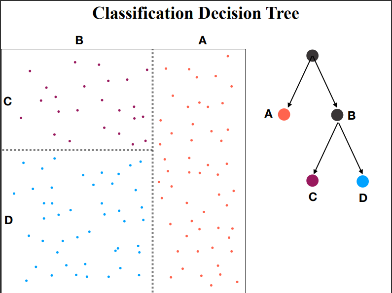

# Decision Trees

In this module, we introduce the Decision Tree algorithm, and demonstrate how to effectively use this algorithm for both classification and regression problems. The Decision Tree algorithm is another simple algorithm that can be easy to understand, since a higher level representation of the data is iteratively constructed from the data. Different approaches to building decision trees have been developed, they differ primarily in the ways the higher level representation is constructed. In the end, a decision tree provides a powerful, predictive model that can capture non-linear effects while also being easy to understand and explain.

In this module, we first explore the basic formalism of the decision tree algorithm, including a discussion on several important concepts that can be used to determine how the tree is constructed from a data set. Next, we introduce the use of the decision tree for classification problems by using the Iris data set. In this section we will examine feature importance, the decision surface, visualizing the predictive tree, and the effect of different hyperparameters, before switching to a more complex data set. Finally, we will look at constructing a decision tree for regression, by using a new data set.

## Formalism

One of the simplest machine learning algorithms to understand is the decision tree. For a classification task, a decision tree asks a set of questions of the data, and based on the answers determines the final classification. The tree is constructed by recursively splitting a data set into new groupings based on a statistical measure of the data along each different dimension. Popular metrics to determine the dimension on which to split and the value at which to split include entropy, information gain, Gini coefficient, and variance reduction. The terminal nodes in the tree are known as leaf nodes, and provide the final predictions. In the simplest form, the leaf node simply provides the final answer; however, the values in the leaf node can also be combined to form a probabilistic classification or regression estimate.

In addition to their simplicity, decision trees have a number of other benefits. First, they are a white box model, which simply means we can understand exactly why a decision tree makes a specific prediction on a given instance. Second, they can handle both numerical and categorical data, and they do not require pre-processing beyond handling missing values. Trees also tend to perform well on large data sets.

On the other hand, decision trees are prone to overfitting; where they model the training data too well and do not generalize to unseen data. Decision trees can have difficulty classifying on unbalanced classes and they can be unstable to minor changes in the training data. Overall, however, the decision tree is one of a handful of standard machine learning algorithms with which you should be familiar. In future notebooks, we will learn how to overcome many of these disadvantages by employing ensemble learning with decision trees.

The following figure shows a data set (on the left) and a simple decision tree (on the right). The root node of the decision tree represents the entire data set. When we subdivide the full data into two sub-populations, we create two child nodes, in this case labeled A and B. We can subdivide these sub-populations even further, as demonstrated in the figure where node B is split into two new child nodes: C and D. This process continues until a pre-defined stopping condition is met. Popular choices for this stopping criteria include a maximum tree depth, a minimum number of points in a terminal node, or simply when the node is pure (i.e., all samples in the node have the same category for a classification task).

{width="65%"}

The decision on which feature to split, and the actual value along that feature on which to split can be performed in several different manners:

Variance reduction: the split choice is made to maximally reduce the variance along a feature, useful for regression problems. Gini impurity: the split choice is made to minimize misclassifications, especially in a multi-class classification domain. Information gain: the split choice is selected to create the purest child nodes, based on the concept of entropy and information theory. Before proceeding with a demonstration of how to construct and use a decision tree classifier, we first explore the concepts of entropy and information gain.

# NEED TO FINISH

fin
