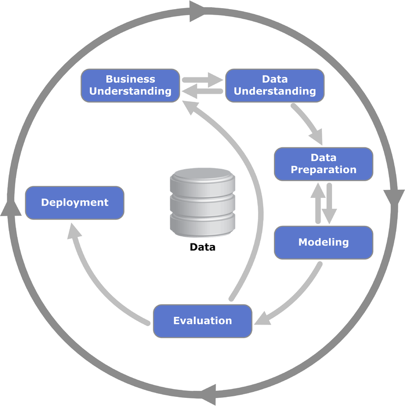

# Getting our hands dirty

As a field, [machine learning](https://en.wikipedia.org/wiki/Machine_learning) is both expansive and mathematically complex. From deriving simple linear relationships via regression analysis to finding clusters of data points in an N-dimensional space; statistical and machine learning techniques can take years to fully master. However, given the short time available in this course, we will take the simpler approach of demonstrating several commonly used approaches in order to both introduce the fundamental concepts in machine learning and the methodology we will use in RStudio to apply these concepts to actual data. For the latter, we will use the standard machine learning library in R, which is the *Caret Package*.

We will demonstrate the four main tasks of machine learning: classification, regression, dimensional reduction, and clustering. Note that this module is simply an introduction to these topics, we will explore these and other areas in more detail throughout this course. Finally, we will discuss how to persist machine learning models.

### Set up

Make sure you have the caret package installed.

```{r, echo=TRUE, eval=FALSE}

install.packages("caret")
```

Run your libraries

```{r,echo=TRUE,warning=FALSE,message=FALSE}
library(tidyverse)
library(caret)
```

The first steps in any data analytics effort, once the business goal has been defined, are to understand and prepare the data of interest. For example, the [**Cross Industry Standard Process for Data Mining**](https://en.wikipedia.org/wiki/Cross_Industry_Standard_Process_for_Data_Mining) or (**CRISP-DM**) starts with the *Business Understanding* step, immediately followed by the *Data Understanding* and *Data Preparation* steps. For machine learning analyses, these latter two steps require loading the data into our notebook, exploring the data either systematically or in a cumulative sense to understand the typical features for different instances. We also can generate descriptive statistical summaries and visualizations, such as a *pair plot*, to understand the data in full. Finally, we will need to clean the data to properly account for missing data, data that are incomplete or formatted incorrectly, or to generate meta-features (such as a date-time) from existing features.

{width="100%"}

For this module, we will focus on a single, simple data set, the standard *Iris* dataset, which is included by default. Note that given a data set, such as the *Iris* data, we have rows, which correspond to different instances (e.g., different flowers), and columns, which correspond to different features of the instances (e.g., different measurements of the flowers). To understand the data, we first load this data into RStudio, before looking at several instances from the data. Next, we will group the data by species to explore cumulative quantities, before extracting a statistical summary of the entire data set. Finally, we will generate a pair plot to visually explore the data. Since this data has already been cleaned (and only consists of four features) we will not need to perform additional tasks.\

Load the data

```{r, echo=TRUE}
#load the data
iris<-iris
```

The data set consists of 150 total measurements of three different types of Iris flowers, equally divided between three classes: Iris setosa, Iris versicolor, and Iris virginica. Before proceeding, we can examine the DataFrame that contains these data to view typical instances, to see a cumulative summary, and a brief statistical summary.

```{r, echo=TRUE}
#examine the top 5 rows
head(iris,5)

#view the whole dataset
knitr::kable(iris)%>%
  kableExtra::kable_styling("striped")%>%
  kableExtra::scroll_box(width = "100%",height="300px")
```

```{r,echo=TRUE}
#examine grouped data
iris%>%
  group_by(Species)%>%
  summarise(count=n())
```

```{r,echo=TRUE}
# Get descriptive statistics
summary(iris)

```

Another handy package

```{r,echo=TRUE,eval=FALSE}
install.packages("psych")

```

```{r,echo=TRUE}
psych::describe(iris)

# ?psych::describe

```

Look up what mad, se, skewness, and kurtosis is... 🕵️

------------------------------------------------------------------------

As demonstrated by the output from the previous code cells, our test data matches our expectations (note that the full Iris data set is listed on [Wikipedia](https://en.wikipedia.org/wiki/Iris_flower_data_set)). These data consist of three types, each with fifty instances, and every row has four measured features (i.e., attributes). The four primary features of the data are *Sepal Length*, *Sepal Width*, *Petal Length*, and *Petal Width*. In simple terms, petals are the showy, colorful part of the Iris flower, while the sepals provide protection and support for the petals.

In addition, our cursory exploration of the DataFrame indicated the data are clean. One simple way to verify this is that the *count* is the same for every feature, and the descriptive statistics (e.g., *min*, *max*, and *mean*) are all numerical. If we had missing or bad data in our DataFrame, these measures would generally indicate the problem. If there were missing data, we could drop any instance with missing data by using the `na.omit` method, or alternatively insert a value by using [`mutate`](https://towardsdatascience.com/data-cleaning-with-r-and-the-tidyverse-detecting-missing-values-ea23c519bc62) . An alternative, and powerful, technique for handling missing data is known as **imputing**, where we apply machine learning[^2] to generate *realistic* values for any missing data. This approach will be demonstrated in a subsequent module.

[^2]: This is a narrow definition because you can also impute with summary statistics such as mean or median.

At this point, we have loaded our data, and verified the data are clean. The next step is to visualize the relationships between the different features in our data.

Lets use another package 😆

```{r, echo=TRUE,eval=FALSE}
install.packages("GGally")
```

Look at me 👀 [ggpairs function](https://r-charts.com/correlation/ggpairs/) 👀

```{r,echo=TRUE,warning=FALSE,message=FALSE}
GGally::ggpairs(iris)
```

```{r,echo=TRUE,warning=FALSE}
GGally::ggpairs(iris, aes(color = Species, alpha = 0.5))
```

These figures indicate that the three Iris species cluster naturally in these dimensions, with minimal overlap. As a result, these data provide an excellent test for different machine learning algorithms.

First, however, we will generate one [scatter plot](https://moderndive.com/2-viz.html#scatterplots) that displays a larger version of the *Sepal Width* versus *Petal Width* scatter plot to highlight the inherent structure in these data. Furthermore, we will refer back to this plot in later analyses in this Module.

```{r, echo=TRUE}
#crash course in plots?
ggplot(data=iris,mapping = aes(x=Sepal.Width,y=Petal.Width,color=Species))+geom_point(alpha=0.5)
```


### Side Note...Other plots 🙈


[Line Graph](https://moderndive.com/2-viz.html#linegraphs)

```{r,echo=TRUE}
#line graph..this is a TERRIBLE example...
#ask me why
iris.setosa<-iris%>%
  filter(Species=="setosa")%>%
  distinct(Sepal.Width,.keep_all = TRUE)

ggplot(data=iris.setosa,mapping = aes(x=Sepal.Width,y=Sepal.Length))+geom_line()

```

[Histograms](https://moderndive.com/2-viz.html#histograms)

```{r,echo=TRUE}
ggplot(data=iris,mapping = aes(x=Sepal.Length,color=Species))+geom_histogram()
```

[Boxplots](https://moderndive.com/2-viz.html#boxplots)

```{r,echo=TRUE}
ggplot(data=iris,mapping = aes(x=Species,y=Sepal.Length))+geom_boxplot()
```

[Bar plots](https://moderndive.com/2-viz.html#geombar)

```{r,echo=TRUE}
ggplot(data=iris,mapping = aes(x=Species))+geom_bar()
```

