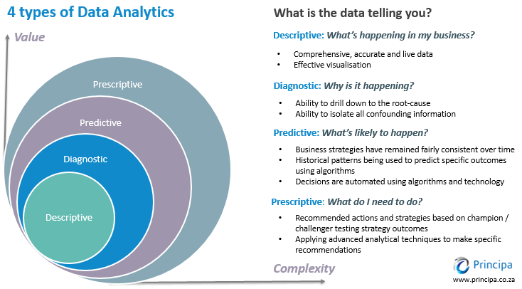

# Game Plan

This module provides the basis for the rest of the course by introducing the basic concepts behind machine learning, and, specifically, how to perform machine learning by using RStudio and the CARET R package. First, you will learn how machine learning and artificial intelligence are disrupting businesses. Next, you will learn about the basic types of machine learning and how to leverage these algorithms in a R script. Third, you will learn how linear regression can be considered a machine learning problem with parameters that must be determined computationally by minimizing a *cost* function. Finally, you will learn about neighbor-based algorithms, including the k-nearest neighbor algorithm, which can be used for both classification and regression tasks.

# Objectives

### **By the end of this module, you should be able to:**

-   articulate the different types of machine learning algorithms and provide examples where each type might be applied within the Accounting profession,

-   describe the challenges in cleaning and pre-processing data,

-   apply the Caret Package to perform basic machine learning tasks,

-   understand the importance of a *cost* function and the importance of minimizing this functions,

-   perform general linear regression by using the Caret Package, and

-   apply the k-nearest neighbor algorithm for both classification and regression tasks.

## **Artificial Intelligence and Accountancy**

This lesson explores the fundamentals of machine learning and artificial intelligence and how these tools are being used in accountancy and business in general.

### Interesting Articles

[How is accountancy and finance world using artificial intelligence](https://www.icas.com/ca-today-news/how-accountancy-and-finance-are-using-artificial-intelligence)

[Financial Statement Audits](http://ww2.cfo.com/auditing/2017/02/artificial-intelligence-audits/)

1.  What is the growing role artificial intelligence (and by association, machine learning) play in modern accounting?

2.  What does the impact technology plays in shaping careers in modern accountancy?

3.  How is artificial intelligence impacting financial auditing?

## **Introduction to Machine Learning**[^1]

[^1]: The is borrowed content from <https://insights.principa.co.za/4-types-of-data-analytics-descriptive-diagnostic-predictive-prescriptive>

{width="100%"}

*Your most important skill will be your ability to translate data into insights that are clear and meaningful to a stakeholder.*

## **The Four Types of Data Analysis are:**

### **1. Descriptive Analytics: What is happening?**

This is the most common of all forms. In business, it provides the analyst with a view of key metrics and measures within the company.

An example of this could be a monthly profit and loss statement. Similarly, an analyst could have data on a large population of customers. Understanding demographic information on their customers (e.g. 30% of our customers are self-employed) would be categorised as "descriptive analytics". Utilising useful visualisation tools enhances the message of descriptive analytics.

### **2. Diagnostic Analytics: Why is it happening?**

This is the next step in complexity in data analytics is descriptive analytics. On the assessment of the descriptive data, diagnostic analytical tools will empower an analyst to drill down and in so doing isolate the root-cause of a problem.

Well-designed business information (BI) dashboards incorporating reading of time-series data (i.e. data over multiple successive points in time) and featuring filters and drill down capability allow for such analysis.

### **3. Predictive Analytics: What is likely to happen?**

Predictive analytics is all about forecasting. Whether it's the likelihood of an event happening in future, forecasting a quantifiable amount or estimating a point in time at which something might happen - these are all done through predictive models.

Predictive models typically utilise a variety of variable data to make the prediction. The variability of the component data will have a relationship with what it is likely to predict (e.g. the older a person, the more susceptible they are to a heart-attack -- we would say that age has a linear correlation with heart-attack risk). These data are then compiled together into a score or prediction.

In a world of significant uncertainty, being able to predict allows one to make better decisions. Predictive models are some of the most important utilised across many fields.

[Common Issues with Prediction](https://insights.principa.co.za/the-top-predictive-analytics-pitfalls-to-avoid)

### **4. Prescriptive Analytics: What do I need to do?**

The next step up regarding value and complexity is the prescriptive model.  The prescriptive model utilises an understanding of what has happened, why it has happened and a variety of "what-might-happen" analysis to help the user determine the best course of action to take. A prescriptive analysis is typically not just with one individual response but is, in fact, a host of other actions.

An excellent example of this is a traffic application helping you choose the best route home and taking into account the distance of each route, the speed at which one can travel on each road and, crucially, the current traffic constraints.

Another example might be producing an exam time-table such that no students have clashing schedules.
