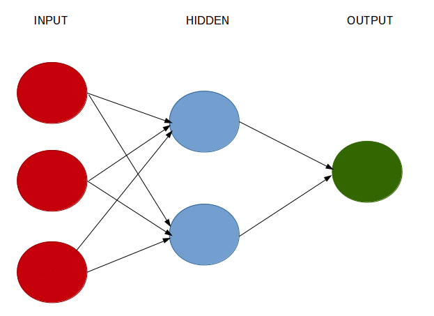
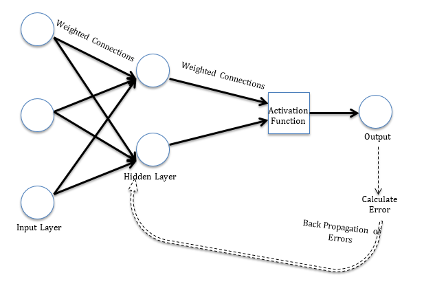

# Introduction[^1]

[^1]: Information from <https://www.analyticsvidhya.com/blog/2017/09/creating-visualizing-neural-network-in-r/>

Neural network is an information-processing machine and can be viewed as analogous to human nervous system. Just like human nervous system, which is made up of interconnected neurons, a neural network is made up of interconnected information processing units. The information processing units do not work in a linear manner. In fact, neural network draws its strength from parallel processing of information, which allows it to deal with non-linearity. Neural network becomes handy to infer meaning and detect patterns from complex data sets.

## **Objectives**

By the end of this lesson, you will be able to

-   articulate the basics of neural networks, and
-   apply neural network algorithms

# Neural Networks[^2]

[^2]: Information from <https://datascienceplus.com/neuralnet-train-and-test-neural-networks-using-r/>

A neural network is a computational system that creates predictions based on existing data. A neural network is a model characterized by an activation function, which is used by interconnected information processing units to transform input into output. A neural network has always been compared to human nervous system. Information in passed through interconnected units analogous to information passage through neurons in humans. The first layer of the neural network receives the raw input, processes it and passes the processed information to the hidden layers. The hidden layer passes the information to the last layer, which produces the output. The advantage of neural network is that it is adaptive in nature. It learns from the information provided, i.e. trains itself from the data, which has a known outcome and optimizes its weights for a better prediction in situations with unknown outcome.

A perceptron, viz. single layer neural network, is the most basic form of a neural network.  A perceptron receives multidimensional input and processes it using a weighted summation and an activation function. It is trained using a labeled data and learning algorithm that optimize the weights in the summation processor. A major limitation of perceptron model is its inability to deal with non-linearity. A multilayered neural network overcomes this limitation and helps solve non-linear problems. The input layer connects with hidden layer, which in turn connects to the output layer. The connections are weighted and weights are optimized using a learning rule.

There are many learning rules that are used with neural network:

-   least mean square;
-   gradient descent;
-   newton's rule;
-   conjugate gradient etc.

The learning rules can be used in conjunction with backpropgation error method. The learning rule is used to calculate the error at the output unit. This error is backpropagated to all the units such that the error at each unit is proportional to the contribution of that unit towards total error at the output unit. The errors at each unit are then used to optimize the weight at each connection.

**A neural network consists of:**

-   **Input layers:** Layers that take inputs based on existing data

-   **Hidden layers:** Layers that use backpropagation to optimise the weights of the input variables in order to improve the predictive power of the model

-   **Output layers:** Output of predictions based on the data from the input and hidden layers

{width="100%"}[**\
** ](https://datascienceplus.com/wp-content/uploads/2018/10/neuralplot.png){width="100%"}[](https://datascienceplus.com/wp-content/uploads/2018/10/neuralplot.png)

```{r nn1}

library(tidyverse)

set.seed(1)
#lets split the data 60/40
library(caret)
trainIndex <- createDataPartition(iris$Species, p = .6, list = FALSE, times = 1)

#grab the data
irisTrain <- iris[ trainIndex,]
irisTest  <- iris[-trainIndex,]

#added something here
IrisNNET<- train(
  form = factor(Species) ~ .,
  data = irisTrain,
  #here we add classProbs because we want probs
  trControl = trainControl(method = "cv", number = 10,
                           classProbs =  TRUE),
  method = "nnet",
  preProcess = c("center", "scale"),
  tuneLength = 5,
  #add this please
  trace=FALSE)

#IrisNNET
knitr::kable(IrisNNET$bestTune)

plot(IrisNNET)


IrisNNET_Pred<-predict(IrisNNET,irisTest,type="prob")

knitr::kable(IrisNNET_Pred)%>%
  kableExtra::kable_styling("striped")%>%
  kableExtra::scroll_box(width = "50%",height="300px")

irisNNETtestpred<-cbind(IrisNNET_Pred,irisTest)

irisNNETtestpred<-irisNNETtestpred%>%
  mutate(prediction=if_else(setosa>versicolor & setosa>virginica,"setosa",
                            if_else(versicolor>setosa & versicolor>virginica, "versicolor",
                                    if_else(virginica>setosa & virginica>versicolor,"virginica", "PROBLEM"))))

table(irisNNETtestpred$prediction)

NNETConfusion<-confusionMatrix(factor(irisNNETtestpred$prediction),factor(irisNNETtestpred$Species))

NNETConfusion
```

```{r nn2}

ggplot(as.data.frame(NNETConfusion$table))+ 
  geom_raster(aes(x=Reference, y=Prediction, fill=Freq)) + 
  geom_text(aes(x=Reference, y=Prediction, label=Freq)) +
   scale_fill_gradient2( low = "red", high = "darkred", na.value="black", name = "Freq" )+
  scale_x_discrete(name="Actual Class") + 
  scale_y_discrete(name="Predicted Class")+
  ggtitle("Confusion is fun")+
  theme(plot.title = element_text(hjust=0.5, size=10, face='bold'))
```

```{r nn3}

#summary(IrisNNET)

#had to add something 
V<-as.data.frame(caret::varImp(IrisNNET)$importance)%>%
  arrange(desc(Overall))

knitr::kable(V)

ggplot2::ggplot(V, aes(x=reorder(rownames(V),Overall), y=Overall)) +
geom_point( color="blue", size=4, alpha=0.6)+
geom_segment( aes(x=rownames(V), xend=rownames(V), y=0, yend=Overall), 
color='skyblue') +
xlab('Variable')+
ylab('Overall Importance')+
theme_light() +
coord_flip() 
```

[NeuralNetTools](https://cran.r-project.org/web/packages/NeuralNetTools/NeuralNetTools.pdf)

```{r nnplot}
#install.packages("NeuralNetTools")

NeuralNetTools::garson(IrisNNET)
NeuralNetTools::olden(IrisNNET)
NeuralNetTools::plotnet(IrisNNET)

```

```{r nn4}

set.seed(1)
#lets split the data 60/40
library(caret)
trainIndex <- createDataPartition(iris$Species, p = .6, list = FALSE, times = 1)

#grab the data
train <- iris[ trainIndex,]
test  <- iris[-trainIndex,]

mygrid<-expand.grid(size = seq(1, 9, by = 2),
                        decay = c(0.0001,0.001,0.01, 0.1))

IrisNNET<- train(
  form = factor(Species) ~ .,
  data = train,
  #here we add classProbs because we want probs
  trControl = trainControl(method = "cv", number = 10,
                           classProbs =  TRUE),
  method = "nnet",
  preProcess = c("center", "scale"),
  tuneGrid = mygrid,
  trace=FALSE)

knitr::kable(IrisNNET$bestTune)


pl = seq(min(iris$Petal.Length), max(iris$Petal.Length), by=0.1)
pw = seq(min(iris$Petal.Width), max(iris$Petal.Width), by=0.1)

# generates the boundaries for your graph
lgrid <- expand.grid(Petal.Length=pl, 
                     Petal.Width=pw,
                     Sepal.Length = 5.4,
                     Sepal.Width=3.1)

IrisNNETGrid2 <- predict(IrisNNET, newdata=lgrid)
IrisNNETGrid <- as.numeric(IrisNNETGrid2)

# get the points from the test data...
testPred <- predict(IrisNNET, newdata=test)
testPred <- as.numeric(testPred)
# this gets the points for the testPred...
test$Pred <- testPred

probs <- matrix(IrisNNETGrid, length(pl), length(pw))

ggplot(data=lgrid) + stat_contour(aes(x=Petal.Length, y=Petal.Width, z=IrisNNETGrid),bins=10) +
  geom_point(aes(x=Petal.Length, y=Petal.Width, colour=IrisNNETGrid2),alpha=.2) +
  geom_point(data=test, aes(x=Petal.Length, y=Petal.Width, shape=Species), size=2) + 
  labs(shape = "Testing Species") +
  geom_point(data=train, aes(x=Petal.Length, y=Petal.Width, color=Species), size=2, alpha=0.75)+
  theme_bw()+ 
  labs(color = "Training Species")+
  ggtitle("Decision Surface")
```

Lets get some more [interesting data:](https://archive.ics.uci.edu/ml/datasets/Las+Vegas+Strip)

```{r ucimlr}

# install.packages("devtools")
# devtools::install_github("tyluRp/ucimlr")

datatoget<-ucimlr::ucidata()

knitr::kable(datatoget)%>%
  kableExtra::kable_styling("striped")%>%
  kableExtra::scroll_box(width = "100%",height="300px")

#https://archive.ics.uci.edu/ml/datasets/Las+Vegas+Strip
# r read csv from url
# allows you to directly download csv file from website
LV_data <- read.csv("https://archive.ics.uci.edu/ml/machine-learning-databases/00397/LasVegasTripAdvisorReviews-Dataset.csv", sep=';')

knitr::kable(head(LV_data,100))%>%
  kableExtra::kable_styling("striped")%>%
  kableExtra::scroll_box(width = "100%",height="300px")

  
```

# Exercise 1

1.  Use LV_data. Predict `Hotel.stars` with neural networks.

# Regression

```{r nnreg, warning=FALSE,message=FALSE}

library(tidyverse)

set.seed(1)
#lets split the data 60/40
library(caret)
trainIndex <- createDataPartition(iris$Sepal.Length, p = .6, list = FALSE, times = 1)

#grab the data
IrisTrain <- iris[ trainIndex,]
IrisTest  <- iris[-trainIndex,]

# mygrid<-expand.grid(size = seq(1, 9, by = 2),
#                         decay = c(0.0001,0.001,0.01, 0.1))

#added something here
IrisNNET<- train(
  form = Sepal.Length~Sepal.Width+Petal.Length+Petal.Width+factor(Species),
  data = IrisTrain,
  #here we add classProbs because we want probs
  trControl = trainControl(method = "cv", number = 10),
  method = "nnet",
  preProcess = c("center", "scale"),
  tuneLength = 5,
  trace=FALSE,
  linout=T)#need for preds

#IrisNNET
knitr::kable(IrisNNET$bestTune)

plot(IrisNNET)


IrisNNET_Pred<-predict(IrisNNET,IrisTest)

knitr::kable(IrisNNET_Pred)%>%
  kableExtra::kable_styling("striped")%>%
  kableExtra::scroll_box(width = "50%",height="300px")

IrisNNETtestpred<-cbind(IrisNNET_Pred,IrisTest)

#root mean squared error
RMSE(IrisNNETtestpred$IrisNNET_Pred,IrisNNETtestpred$Sepal.Length)
#best measure ever...RSquared 
cor(IrisNNETtestpred$IrisNNET_Pred,IrisNNETtestpred$Sepal.Length)^2

```

## Partial Dependence Plots

```{r pdp}

# Compute partial dependence 
pd <- pdp::partial(IrisNNET, pred.var = c("Sepal.Width","Petal.Length"))

# Default PDP
pdp::plotPartial(pd)

# Add contour lines and use a different color palette
rwb <- colorRampPalette(c("darkred", "white", "pink"))
pdp::plotPartial(pd, contour = TRUE, col.regions = rwb)

# 3-D surface
pdp::plotPartial(pd, levelplot = FALSE, zlab = "Sepal Length", colorkey = TRUE, 
                    screen = list(z = -20, x = -60))

# Interpolate the partial dependence values
dens <- akima::interp(x = pd$Sepal.Width, y = pd$Petal.Length, z = pd$yhat)

# 3D partial dependence plot with a coloring scale
p3 <- plotly::plot_ly(x = dens$x, 
          y = dens$y, 
          z = dens$z,
          colors = c("blue", "grey", "red"),
          type = "surface")
# Add axis labels for 3D plots

p3 <- p3%>% plotly::layout(scene = list(xaxis = list(title = 'Sepal Width'),
                     yaxis = list(title = 'Petal Length'),
                     zaxis = list(title = 'Predicted Sepal Length')))
# Show the plot
p3

```

fin
