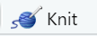

```{r setup, include=FALSE}
knitr::opts_chunk$set(echo = FALSE)
```

# Module Objectives

-   Discuss R/RStudio Basics
-   Define RMarkdown and its uses
-   Explain why a RMarkdown document would be helpful to accountants
-   Demonstrate basic knowledge of RMarkdown syntax

# Why R

-   R is an open-source statistical programming language and environment that has become a [lingua franca](https://en.wikipedia.org/wiki/Lingua_franca) for data science

-   R is popular in academia, and many commercial enterprises are exploring ways to use the tool more extensively, typically as a complement to commercial tools such as SAS

-   Open-source alternative to licensed statistical programming tools

    -   Base R console

    -   Thousands of community-developed packages with specialized functions

    -   RStudio and other open-source GUI/IDEs

## RGui and Rstudio

{width="100%"}

## Getting Started

-   The best thing to do for this class is create a folder on your desktop. For example I have a folder called "R projects" on my desktop.

-   Next click file\>New Project\>New Directory\>New Project

    -   Browse to your desktop folder

    -   Name the directory: ACC8143

{width="100%"}

## RStudio

{width="100%"}

## What are R Packages?

R packages extend the functionality of R by providing additional functions, data, and documentation. They are written by a worldwide community of R users and can be downloaded for free from the internet.

A good analogy for R packages is they are like apps you can download onto a mobile phone:

{width="100%"}

So R is like a new mobile phone: while it has a certain amount of features when you use it for the first time, it doesn't have everything. R packages are like the apps you can download onto your phone from Apple's App Store or Android's Google Play.

Let's continue this analogy by considering the Instagram app for editing and sharing pictures. Say you have purchased a new phone and you would like to share a photo you have just taken with friends on Instagram. You need to:

1.  *Install the app*: Since your phone is new and does not include the Instagram app, you need to download the app from either the App Store or Google Play. You do this once and you're set for the time being. You might need to do this again in the future when there is an update to the app.

2.  *Open the app*: After you've installed Instagram, you need to open it.

Once Instagram is open on your phone, you can then proceed to share your photo with your friends and family. The process is very similar for using an R package. You need to:

1.  *Install the package*: This is like installing an app on your phone. Most packages are not installed by default when you install R and RStudio. Thus if you want to use a package for the first time, you need to install it first. Once you've installed a package, you likely won't install it again unless you want to update it to a newer version.

2.  *"Load" the package*: "Loading" a package is like opening an app on your phone. Packages are not "loaded" by default when you start RStudio on your computer; you need to "load" each package you want to use every time you start RStudio.

## Errors, warnings, and messages

-   If the text starts with "Error", figure out what's causing it. [Think of errors as a red traffic light: something is wrong!]{style="color:red"}

-   If the text starts with "Warning", figure out if it's something to worry about. For instance, if you get a warning about missing values in a scatterplot and you know there are missing values, you're fine. If that's surprising, look at your data and see what's missing. [Think of warnings as a yellow traffic light: everything is working fine, but watch out/pay attention.]{style="color:gold"}

-   Otherwise, the text is just a message. Read it, wave back at R, and thank it for talking to you. [Think of messages as a green traffic light: everything is working fine and keep on going!]{style="color:green"}

# What is RMarkdown?[^1]

[^1]: The information for this module is from [RStudio](https://rmarkdown.rstudio.com/lesson-1.html)

```{r}
vembedr::embed_url("https://vimeo.com/178485416")
```

## Overview

R Markdown provides an authoring framework for data science. You can use a single R Markdown file to both

-   save and execute code
-   generate high quality reports that can be shared with an audience

## Installation

Like the rest of R, R Markdown is free and open source. You can install the R Markdown package from [CRAN](https://cran.r-project.org/) with:

```{r install,  eval=FALSE, echo=TRUE}
install.packages("rmarkdown")
```

#### Once you have installed rmarkdown you can create a document

{width="100%"}

#### Notice that the file contains three types of content:

-   An (optional) YAML header surrounded by `---`s
-   R code chunks surrounded by ```` ``` ````s
-   text mixed with simple text formatting
-   You can run each code chunk by clicking the  icon. RStudio executes the code and display the results inline with your file. {width="100%"}

## Rendering output

To generate a report from the file, run the `render` command:

``` {.r eval="FALSE"}
library(rmarkdown)
render("1-example.Rmd")
```

Better still, use the "Knit" button in the RStudio IDE to render the file and preview the output with a single click. {width="10%"}

R Markdown generates a new file that contains selected text, code, and results from the .Rmd file. The new file can be a finished [web page](https://bookdown.org/yihui/rmarkdown/html-document.html), [PDF](https://bookdown.org/yihui/rmarkdown/pdf-document.html), [MS Word](https://bookdown.org/yihui/rmarkdown/word-document.html) document, [slide show](https://bookdown.org/yihui/rmarkdown/ioslides-presentation.html), [notebook](https://bookdown.org/yihui/rmarkdown/notebook.html), [handout](https://bookdown.org/yihui/rmarkdown/tufte-handouts.html), [book](https://bookdown.org/), [dashboard](https://rmarkdown.rstudio.com/flexdashboard/index.html), [package vignette](https://bookdown.org/yihui/rmarkdown/r-package-vignette.html) or [other format](https://rmarkdown.rstudio.com/formats.html).

## How it works

{width="100%"}\

When you run `render`, R Markdown feeds the .Rmd file to [knitr](http://yihui.name/knitr/), which executes all of the code chunks and creates a new markdown (.md) document which includes the code and its output.

The markdown file generated by knitr is then processed by [pandoc](http://pandoc.org/) which is responsible for creating the finished format.

This may sound complicated, but R Markdown makes it extremely simple by encapsulating all of the above processing into a single `render` function.

Knowing the details is beyond this class, but the gist is that we can create documents with code and output. The facilitates reproducible reports.

Imagine having to generate the same reports each week/month from excel spreadsheets. To some extent you would have to add the formulas that you need to generate the numbers/summary stats you need for the report. [**BUT** if your original report contained the necessary code to generate the desired output all you would have to do is update the data.]{style="color:red"}

## Code Chunks

You can quickly insert chunks like these into your file with

the keyboard shortcut Ctrl + Alt + I (OS X: Cmd + Option + I) the Add Chunk command in the editor toolbar or by typing the chunk delimiters `{r} and`.

When you render your .Rmd file, R Markdown will run each code chunk and embed the results beneath the code chunk in your final report.

#### Chunk Options

Chunk output can be customized with [knitr options](http://yihui.name/knitr/options/), arguments set in the `{}` of a chunk header. Above, we use five arguments:

-   `include = FALSE` prevents code and results from appearing in the finished file. R Markdown still runs the code in the chunk, and the results can be used by other chunks.
-   `echo = FALSE` prevents code, but not the results from appearing in the finished file. This is a useful way to embed figures.
-   `message = FALSE` prevents messages that are generated by code from appearing in the finished file.
-   `warning = FALSE` prevents warnings that are generated by code from appearing in the finished.
-   `fig.cap = "..."` adds a caption to graphical results.

# Exercise \#1

Answer the following questions. $\color{red}{\text{Do not peek at the answers.}}$👊

1.  Add echo=FALSE to the following code in your rmarkdown file what happens?

    ```` ```{r cars} ````\
    `summary(cars)`\
    ```` ``` ````

    <details>

    <summary>

    Answer

    </summary>

    ```{r Exercise_1_1_rmarkdown, echo=FALSE, out.width = '100%'}
      knitr::include_graphics("images/Exercise_1_1_rmarkdown.gif")
    ```

    </details>

2.  Add include=FALSE to the following code in your rmarkdown file what happens?

    ```` ```{r cars} ````\
    `summary(cars)`\
    ```` ``` ````

    <details>

    <summary>

    Answer

    </summary>

    ```{r Exercise_1_2_rmarkdown, echo=FALSE, out.width = '100%'}
      knitr::include_graphics("images/Exercise_1_2_rmarkdown.gif")
    ```

    </details>

3.  Add a caption to the following code in your rmarkdown file.

    ```` ```{r pressure, echo=FALSE} ````\
    `plot(pressure)`\
    ```` ``` ````

    <details>

    <summary>

    Answer

    </summary>

    ```{r Exercise_1_3_rmarkdown, echo=FALSE, out.width = '100%'}
      knitr::include_graphics("images/Exercise_1_3_rmarkdown.gif")
    ```

    </details>

See the [R Markdown Reference Guide](https://www.rstudio.com/wp-content/uploads/2015/03/rmarkdown-reference.pdf) for a complete list of knitr chunk options.

#### Global Options

To set global options that apply to every chunk in your file, call `knitr::opts_chunk$set` in a code chunk. Knitr will treat each option that you pass to `knitr::opts_chunk$set` as a global default that can be overwritten in individual chunk headers.

#### Caching

If document rendering becomes time consuming due to long computations you can use knitr caching to improve performance. [*Knitr chunk and package options*](http://yihui.name/knitr/options) describes how caching works and the [*Cache examples*](http://yihui.name/knitr/demo/cache/) provide additional details.

## Inline Code

Code results can be inserted directly into the text of a .Rmd file by enclosing the code with `` `r ` ``.

copy the following code and add it to your default .Rmd file

```` {.r}
# Inline Code example

```{r inline, include=FALSE}`r ''`
cars_variable<-"dist"
#cars_variable<-"speed"
```


You can use the `<-` to store information in objects. 
`object <- information`. The above code stores  `r "\u0060r cars_variable\u0060"`  in cars_variable.


```{r select, message=FALSE}`r ''`
library(dplyr)
cars%>%
  select(c(paste(cars_variable)))

```
````

{width="100%"}

## Code Languages

[knitr](http://yihui.name/knitr/) can execute code in many languages besides R. Some of the available language engines include:

-   Python
-   SQL
-   Bash
-   Rcpp
-   Stan
-   JavaScript
-   CSS

To process a code chunk using an alternate language engine, replace the `r` at the start of your chunk declaration with the name of the language. To connect to a data base first connect to the database using R code. See the following example:

**CODE**

```` {.r}
```{r, echo=TRUE}`r ''`
library(DBI)
db = dbConnect(RSQLite::SQLite(), dbname = "data/03-Data-file-classroom-exercise-Chinook_Sqlite.sqlite")
```
````

**OUTPUT**

```{r, echo=TRUE}
library(DBI)
db = dbConnect(RSQLite::SQLite(), dbname = "data/03-Data-file-classroom-exercise-Chinook_Sqlite.sqlite")
```

Next start your chunk with the declaration of the language.

**CODE**

```` {.r}
```{sql, connection=db, echo=TRUE}`r ''`
SELECT count(*) 
FROM pragma_table_info("Customer")
```
````

**OUTPUT**

```{sql, connection=db, echo=TRUE}
SELECT count(*) 
FROM pragma_table_info("Customer")
```

Note that chunk options like `echo` and `results` are all valid when using another language engine.

Learn more about using other languages with R Markdown in [knitr Language Engines](https://bookdown.org/yihui/rmarkdown/language-engines.html).

## Parameters

R Markdown documents can include one or more parameters whose values can be set when you render the report.

{width="100%"}

#### Update your Rmd with

**YAML CODE**

Watch the spacing and placement

``` {.r}
params: 
  cars_var: "dist"
```

**CODE**

```` {.r}
# Parameters

The YAML code above stores  `r "\u0060r params$cars_var\u0060"` in params$cars_var.


```{r select 2, message=FALSE}`r ''`
library(dplyr)
cars%>%
  select(c(paste(params$cars_var)))

```
````

### Declaring Parameters

Parameters are declared using the `params` field within the YAML header of the document. For example, the file above creates the parameter `cars_var` and assigns it the default value `"dist"`.

### Using Parameters in Code

Parameters are made available within the knit environment as a read-only list named `params`. To access a parameter in code, call `params$<parameter name>`.

### Setting Parameters values

Add a `params` argument to `render` to create a report that uses a new set of parameter values. Here we modify our report to use the `speed` variable with

    render("rmarkdown_demo.Rmd", params = list(cars_var = "speed"))

Better yet, click the "Knit with Parameters" option in the dropdown menu next to the RStudio IDE knit button to set parameters, render, and preview the report in a single user friendly step.

{width="100%"}

Parameters are useful when you want to re-render the same report with distinct values for various key inputs, for example:

-   Running a report specific to a department or geographic region.
-   Running a report that covers a specific period in time.
-   Running multiple versions of a report for distinct sets of core assumptions.

Learn more about parameters at [Paramaterized Reports](https://bookdown.org/yihui/rmarkdown/parameterized-reports.html).

## Tables

By default, R Markdown displays data frames and matrices as they would be in the R terminal (in a monospaced font). If you prefer that data be displayed with additional formatting you can use the `knitr::kable` function.

{width="100%"}

**CODE**

```` {.r}
# Tables

**knitr kable**
```{r kable tables ,echo=FALSE, results='asis'}`r ''`
library(knitr)
kable(head(cars,5),caption="Kable Table")
```

**default table**
```{r default tables, echo=FALSE}`r ''`
head(cars,5)
```
````

Note the use of the `results='asis'` chunk option. This is required to ensure that the raw table output isn't processed further by knitr.

## Markdown Basics

Format the text in your R Markdown file with [Pandoc's Markdown](https://rmarkdown.rstudio.com/authoring_pandoc_markdown.html), a set of markup annotations for plain text files. When you render your file, Pandoc transforms the marked up text into formatted text in your final file format.

<aside>

note that header 2 is not functioning properly

</aside>

+-----------------------------------------------------+--------------------------------------------------------------------------+
| syntax                                              | becomes                                                                  |
+:====================================================+:=========================================================================+
| `plain text`                                        | plain text                                                               |
+-----------------------------------------------------+--------------------------------------------------------------------------+
| `End a line with two spaces`                        | End a line with two spaces to start a                                    |
|                                                     |                                                                          |
| `to start a  new paragraph`                         | new paragraph                                                            |
+-----------------------------------------------------+--------------------------------------------------------------------------+
| `*italics* and _italics_`                           | *italics* and *italics*                                                  |
+-----------------------------------------------------+--------------------------------------------------------------------------+
| `**bold** and __bold__`                             | **bold** and **bold**                                                    |
+-----------------------------------------------------+--------------------------------------------------------------------------+
| `superscript^2^`                                    | superscript^2^                                                           |
+-----------------------------------------------------+--------------------------------------------------------------------------+
| `~~strikethrough~~`                                 | ~~strikethrough~~                                                        |
+-----------------------------------------------------+--------------------------------------------------------------------------+
| `[link](www.rstudio.com)`                           | [link](www.rstudio.com)                                                  |
+-----------------------------------------------------+--------------------------------------------------------------------------+
| `# Header 1`                                        | # Header 1                                                               |
+-----------------------------------------------------+--------------------------------------------------------------------------+
| `## Header 2`                                       | ## Header 2                                                              |
+-----------------------------------------------------+--------------------------------------------------------------------------+
| `### Header 3`                                      | ### Header 3                                                             |
+-----------------------------------------------------+--------------------------------------------------------------------------+
| `#### Header 4`                                     | #### Header 4                                                            |
+-----------------------------------------------------+--------------------------------------------------------------------------+
| `##### Header 5`                                    | ##### Header 5                                                           |
+-----------------------------------------------------+--------------------------------------------------------------------------+
| `###### Header 6`                                   | ###### Header 6                                                          |
+-----------------------------------------------------+--------------------------------------------------------------------------+
| `endash: --`                                        | endash: --                                                               |
+-----------------------------------------------------+--------------------------------------------------------------------------+
| `emdash: ---`                                       | emdash: ---                                                              |
+-----------------------------------------------------+--------------------------------------------------------------------------+
| `ellipsis: ...`                                     | ellipsis: ...                                                            |
+-----------------------------------------------------+--------------------------------------------------------------------------+
| `inline equation: $A = \pi*r^{2}$`                  | inline equation: $A = \pi*r^{2}$                                         |
+-----------------------------------------------------+--------------------------------------------------------------------------+
| `image: ` | {width="110" height="63"}      |
+-----------------------------------------------------+--------------------------------------------------------------------------+
| `horizontal rule (or slide break): ***`             | horizontal rule (or slide break):                                        |
|                                                     |                                                                          |
|                                                     | ------------------------------------------------------------------------ |
+-----------------------------------------------------+--------------------------------------------------------------------------+
| `> block quote`                                     | > block quote                                                            |
+-----------------------------------------------------+--------------------------------------------------------------------------+
| `* unordered list`                                  | -   unordered list                                                       |
|                                                     |                                                                          |
| `* item 2`                                          | -   item 2                                                               |
|                                                     |                                                                          |
| `+ sub-item 1`                                      |     -   sub-item 1                                                       |
|                                                     |                                                                          |
| `+ sub-item 2`                                      |     -   sub-item 2                                                       |
+-----------------------------------------------------+--------------------------------------------------------------------------+
| `1. ordered list`                                   | 1.  ordered list                                                         |
|                                                     |                                                                          |
| `2. item 2`                                         | 2.  item 2                                                               |
|                                                     |                                                                          |
| `+ sub-item 1`                                      |     -   sub-item 1                                                       |
|                                                     |                                                                          |
| `+ sub-item 2`                                      |     -   sub-item 2                                                       |
+-----------------------------------------------------+--------------------------------------------------------------------------+
| `Table Header | Second Header`                      | | Table Header | Second Header |                                         |
|                                                     | |--------------|---------------|                                         |
| `------------- | -------------`                     | | Table Cell   | Cell 2        |                                         |
|                                                     | | Cell 3       | Cell 4        |                                         |
| `Table Cell | Cell 2`                               |                                                                          |
|                                                     |                                                                          |
| `Cell 3 | Cell 4`                                   |                                                                          |
+-----------------------------------------------------+--------------------------------------------------------------------------+

[CHEATSHEET](https://www.rstudio.com/wp-content/uploads/2015/02/rmarkdown-cheatsheet.pdf)

[CHEATSHEET2](https://github.com/rstudio/cheatsheets/blob/master/rmarkdown-2.0.pdf)

# Exercise \#2

1.  Create an Exercise 2 heading in your Rmd file and give at least 5 examples of syntax (don't include any headers). Be sure and knit to check it.

## Output Formats

Set the `output_format` argument of `render` to render your .Rmd file into any of R Markdown's supported formats. For example, the code below renders NAMEOFYOURFILE.Rmd to a Microsoft Word document.

`library(rmarkdown)`

`render("NAMEOFYOURFILE.Rmd", output_format = "word_document")`

If you do not select a format, R Markdown renders the file to its default format, which you can set in the `output` field of a .Rmd file's header. The header of NAMEOFYOURFILE.Rmd shows that it renders to an HTML file by default.

The RStudio IDE knit button renders a file to the first format listed in its `output` field. You can render to additional formats by clicking the dropdown menu beside the knit button:

{width="100%"}

The following output formats are available to use with R Markdown.

### Documents

-   [html_notebook](https://bookdown.org/yihui/rmarkdown/notebook.html) - Interactive R Notebooks

-   [html_document](https://bookdown.org/yihui/rmarkdown/html-document.html) - HTML document w/ Bootstrap CSS

-   [pdf_document](https://bookdown.org/yihui/rmarkdown/pdf-document.html) - PDF document (via LaTeX template)

-   [word_document](https://bookdown.org/yihui/rmarkdown/word-document.html) - Microsoft Word document (docx)

-   [odt_document](https://bookdown.org/yihui/rmarkdown/opendocument-text-document.html) - OpenDocument Text document

-   [rtf_document](https://bookdown.org/yihui/rmarkdown/rich-text-format-document.html) - Rich Text Format document

-   [md_document](https://bookdown.org/yihui/rmarkdown/markdown-document.html) - Markdown document (various flavors)

### Presentations (slides)

-   [ioslides_presentation](https://bookdown.org/yihui/rmarkdown/ioslides-presentation.html) - HTML presentation with ioslides

-   [revealjs::revealjs_presentation](https://bookdown.org/yihui/rmarkdown/revealjs.html) - HTML presentation with reveal.js

-   [slidy_presentation](https://bookdown.org/yihui/rmarkdown/slidy-presentation.html) - HTML presentation with W3C Slidy

-   [beamer_presentation](https://bookdown.org/yihui/rmarkdown/beamer-presentation.html) - PDF presentation with LaTeX Beamer

-   [powerpoint_presentation](https://bookdown.org/yihui/rmarkdown/powerpoint-presentation.html): PowerPoint presentation

### More

-   [flexdashboard::flex_dashboard](https://rmarkdown.rstudio.com/flexdashboard/) - Interactive dashboards

-   [tufte::tufte_handout](https://bookdown.org/yihui/rmarkdown/tufte-handouts.html) - PDF handouts in the style of Edward Tufte

-   [tufte::tufte_html](https://bookdown.org/yihui/rmarkdown/tufte-handouts.html) - HTML handouts in the style of Edward Tufte

-   [tufte::tufte_book](https://bookdown.org/yihui/rmarkdown/tufte-handouts.html) - PDF books in the style of Edward Tufte

-   [html_vignette](https://bookdown.org/yihui/rmarkdown/r-package-vignette.html) - R package vignette (HTML)

-   [github_document](https://rmarkdown.rstudio.com/github_document_format.html) - GitHub Flavored Markdown document

You can also build [books](https://bookdown.org/), [websites](https://bookdown.org/yihui/rmarkdown/rmarkdown-site.html), and [interactive documents](https://bookdown.org/yihui/rmarkdown/shiny-documents.html) with R Markdown.

### Output Options

Each output format is implemented as a function in R. You can customize the output by passing arguments to the function as sub-values of the `output` field.

{width="100%"}

To learn which arguments a format takes, read the format's help page in R, e.g. `?html_document`.

# Assignment

Turn in an RMD file and a html file of your resume.
