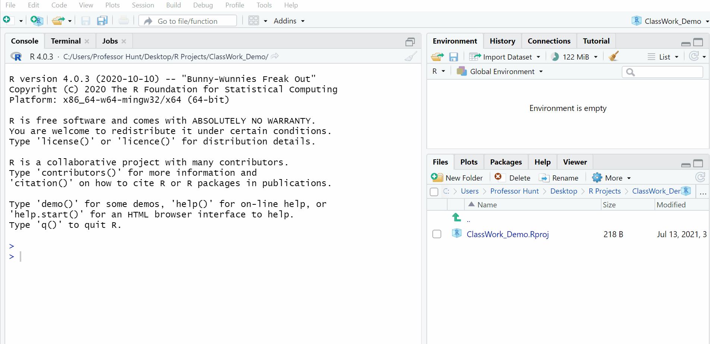
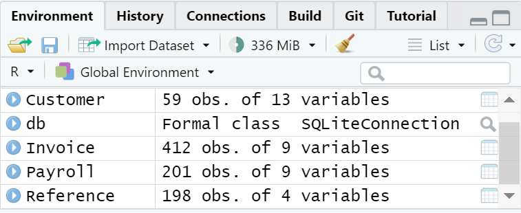

```{r setup, include=FALSE}
knitr::opts_chunk$set(echo = FALSE)
```

This module is based in part on a [PWC case study](https://www.pwc.com/us/en/careers/university-relations/data-and-analytics-case-studies.html) (Graduate level Data Management and Analysis Course), [R for Data Science](https://r4ds.had.co.nz/index.html), and [ModernDive](https://moderndive.com/index.html). I am changing a few things from the PWC case study, most notably is the use of the Tidyverse R packages. I will introduce dplyr for data manipulation and ggplot2 for visualizations. I am also dropping the AI/Predictive modeling portion for this section. We will focus on AI/ML later.

# Module Objectives

-   Explain fundamentals of statistical programming with R
-   Demonstrate basic approaches to acquire, transform, analyze, and visualize data in R

# Statistical programming tools

{width="100%"}

# R programming basics

Lets create a new script to store our code. If we want to keep our code, then we must use a script. Also remember that `#` allows you to make comments that are not run as code. The key shortcut is:

ctrl (cmd)+shift+N

{width="100%"}

You can use R as a calculator:

```{r,  echo=TRUE}
1 / 200 * 30
(59 + 73 + 2) / 3
sin(pi / 2)
```

You can create new objects with `<-`:

```{r,  echo=TRUE}
x <- 3 * 4
x
```

All R statements where you create objects, **assignment** statements, have the same form:

```{r , echo=TRUE, eval = FALSE}
object_name <- value
```

When reading that code say "object name gets value" in your head.

You will make lots of assignments and `<-` is a pain to type. Don't be lazy and use `=`: it will work, but it will cause confusion later.

## What's in a name?

R is case-sensitive, so objects and functions must be used with correct capitalization. Object names must start with a letter, and can only contain letters, numbers, `_` and `.`. You want your object names to be descriptive, so you'll need a convention for multiple words. I recommend **snake_case** where you separate lowercase words with `_`.

```{r,   eval = FALSE, echo=TRUE}
i_use_snake_case
otherPeopleUseCamelCase
some.people.use.periods
And_aFew.People_RENOUNCEconvention
```

```{r,   echo=TRUE,error=TRUE}
x_value <- 3 * 4
X_value
```

```{r,  echo=TRUE,error=TRUE}
x_value <- 3 * 4
x_Value
```

## Calling functions

R has a large collection of built-in functions that are called like this:

```{r , eval = FALSE}
function_name(arg1 = val1, arg2 = val2, ...)
```

Let's try using `seq()` which makes regular **seq**uences of numbers and, while we're at it, learn more helpful features of RStudio.

```{r, echo=TRUE}
seq(1, 10)
```

Type this code and notice you get similar assistance with the paired quotation marks:

```{r, echo=TRUE}
x <- "hello world"
```

Quotation marks and parentheses must always come in a pair. RStudio does its best to help you, but it's still possible to mess up and end up with a mismatch. If this happens, R will show you the continuation character "+":

    > x <- "hello
    +  

The `+` tells you that R is waiting for more input; it doesn't think you're done yet. Usually that means you've forgotten either a `"` or a `)`. Either add the missing pair, or press ESCAPE to abort the expression and try again.

If you make an assignment, you don't get to see the value. You're then tempted to immediately double-check the result:

```{r, echo=TRUE}
y <- seq(1, 10, length.out = 5)
y
```

This common action can be shortened by surrounding the assignment with parentheses, which causes assignment and "print to screen" to happen.

```{r,  echo=TRUE}
(y <- seq(1, 10, length.out = 5))
```

Now look at your environment in the upper right pane. What is there?

The objects we created.

Interested in keyboard shortcuts... try: Alt+Shift+K or use the menus 😄

## Prerequisites

In this module we are going to focus on how to use the dplyr package. If you have not already you need to install the tidyverse of packages. Installing packages is like downloading an app for your phone that adds functionality. After you download an app you have to tap it to use..in R to *tap* the package you use `library(package_name)`.

```{r setup2,  echo=TRUE,eval=FALSE}
install.packages("tidyverse")

```

```{r load libraries,   echo=TRUE,warning=FALSE}
library(tidyverse)
```

We can use the data from RMarkdown Module.

Remember dbname="**LOCATION OF YOUR DATABASE**"

```{r,   echo=TRUE}
library(DBI)
db = dbConnect(RSQLite::SQLite(), dbname = "data/03-Data-file-classroom-exercise-Chinook_Sqlite.sqlite")
```

Lets move the tables into R

```{r,   echo=TRUE}
Customer<-dbReadTable(db,"Customer")
```

```{r,   echo=TRUE}
Invoice<-dbReadTable(db,"Invoice")
```

You can also accomplish the same task in a RMarkdown document using SQL with the following code:

```` r
```{sql, connection=db, echo=TRUE, output.var="Customer"}`r ''`
SELECT * 
FROM Customer
```

```{sql, connection=db, echo=TRUE, output.var="Invoice"}`r ''`
SELECT * 
FROM Invoice
```
````

{width="100%"}

[Resource for working with databases in R.](https://www.r-bloggers.com/2019/08/a-comprehensive-introduction-to-working-with-databases-using-r/)

Lets also import our data. I almost always use the import wizard.

{width="100%"}

This is the code that the wizard produces for us:

```{r import1, echo=TRUE, warning=TRUE}
#don't forget libraries
library(readr)

Session_2_data_file_1_payroll_data <- read_delim("data/Session-2-data-file-1-payroll_data.txt", "|", escape_double = FALSE, trim_ws = TRUE)

library(readxl)

Session_2_data_file_2_reference_data <- read_excel("data/Session-2-data-file-2-reference-data.xlsx")
```

**Note: Whenever we run tidyverse library it loads several packages**

## Basic Syntax

Lets start with storing our imported data in names we like. This could have been done in the import wizard, but lets do it now.

```{r,   echo=TRUE}
Payroll<-Session_2_data_file_1_payroll_data
Reference<-Session_2_data_file_2_reference_data
```

We can remove the old datasets from our environment by using `rm()`

```{r,   echo=TRUE}
rm(Session_2_data_file_1_payroll_data)
rm(Session_2_data_file_2_reference_data)
```

At this point you should have a database connection "db" in your environment and 4 datasets: Customer, Invoice, Payroll, and Reference. We are going to learn how to fix the same errors that are present in the data.

{width="50%"}

We are going to be using the dplyr package for data manipulation or data wrangling.

<aside>

dplyr package is loaded whenever you run library(tidyverse)

</aside>

## Operators

### Arithmetic Operators

| **Operator** | **Description**             |
|:-------------|:----------------------------|
| `+`          | addition                    |
| `-`          | subtraction                 |
| `*`          | multiplication              |
| `/`          | division                    |
| \^ or \*\*   | exponentiation              |
| x%%y         | modulus (x mod y) 5%%2 is 1 |
| x%/%y        | integer division 5%/%2 is 2 |

### Logical Operators {#logical-operators}

| **Operator** | **Description**          |
|:-------------|:-------------------------|
| \<           | less than                |
| \<=          | less than or equal to    |
| \>           | greater than             |
| \>=          | greater than or equal to |
| ==           | exactly equal to         |
| !=           | not equal to             |
| !x           | Not x                    |
| x\|y         | x OR y                   |
| x&y          | x AND y                  |
| isTRUE(x)    | test if x is TRUE        |

## Built-in Functions

-   R has many built in functions that compute different statistical procedures.
-   Functions in R are followed by ( ).
-   Inside the parenthesis we write the object (vector, array, matrix, dataframe) to which we want to apply the function.

### Numeric Functions

| **Function**           | **Description**                       |
|:-----------------------|:--------------------------------------|
| abs(x)                 | absolute value                        |
| sqrt(x)                | square root                           |
| ceiling(x)             | ceiling(3.475) is 4                   |
| floor(x)               | floor(3.475) is 3                     |
| trunc(x)               | trunc(5.99) is 5                      |
| round(x, digits=n)     | round(3.475, digits=2) is 3.48        |
| signif(x, digits=n)    | signif(3.475, digits=2) is 3.5        |
| cos(x), sin(x), tan(x) | also acos(x), cosh(x), acosh(x), etc. |
| log(x)                 | natural logarithm                     |
| log10(x)               | common logarithm                      |
| exp(x)                 | e\^x                                  |

### Character Functions

+--------------------------------------------------------------+-------------------------------------------------------------------------------------------------------------------------------------------------------------------------------------------------------+
| **Function**                                                 | **Description**                                                                                                                                                                                       |
+:=============================================================+:======================================================================================================================================================================================================+
| substr(x, start=n1, stop=n2)                                 | Extract or replace substrings in a character vector. x \<- "abcdef", substr(x, 2, 4) is "bcd"                                                                                                         |
+--------------------------------------------------------------+-------------------------------------------------------------------------------------------------------------------------------------------------------------------------------------------------------+
| grep(pattern, x, ignore.case=FALSE, fixed=FALSE)             | Search for pattern in x. If fixed =FALSE then pattern is a regular expression. If fixed=TRUE then pattern is a text string. Returns matching indices. grep("A", c("b","A","c"), fixed=TRUE) returns 2 |
+--------------------------------------------------------------+-------------------------------------------------------------------------------------------------------------------------------------------------------------------------------------------------------+
| sub(pattern, replacement, x, ignore.case=FALSE, fixed=FALSE) | Find pattern in x and replace with replacement text. If fixed=FALSE then pattern is a regular expression. If fixed = T then pattern is a text string. sub("",".","Hello There") returns "Hello.There" |
+--------------------------------------------------------------+-------------------------------------------------------------------------------------------------------------------------------------------------------------------------------------------------------+
| strsplit(x, split)                                           | Split the elements of character vector x at split. strsplit("abc", "") returns 3 element vector "a","b","c"                                                                                           |
+--------------------------------------------------------------+-------------------------------------------------------------------------------------------------------------------------------------------------------------------------------------------------------+
| paste(..., sep="")                                           | Concatenate strings after using sep string to seperate them. paste("x",1:3,sep="") returns c("x1","x2" "x3") paste("x",1:3,sep="M") returns c("xM1","xM2" "xM3") paste("Today is", date())            |
+--------------------------------------------------------------+-------------------------------------------------------------------------------------------------------------------------------------------------------------------------------------------------------+
| toupper(x)                                                   | Uppercase                                                                                                                                                                                             |
+--------------------------------------------------------------+-------------------------------------------------------------------------------------------------------------------------------------------------------------------------------------------------------+
| tolower(x)                                                   | Lowercase                                                                                                                                                                                             |
+--------------------------------------------------------------+-------------------------------------------------------------------------------------------------------------------------------------------------------------------------------------------------------+

### Statistical Functions

+---------------------------------------------------------------------------------------+----------------------------------------------------------------------------------------------------------------------------------------------------------------------------------------------------------------------------------------------------+
| **Function**                                                                          | **Description**                                                                                                                                                                                                                                    |
+:======================================================================================+:===================================================================================================================================================================================================================================================+
| dnorm(x)                                                                              | normal density function (by default m=0 sd=1) \# plot standard normal curve x \<- pretty(c(-3,3), 30) y \<- dnorm(x) plot(x, y, type="l", xlab="Normal Deviate", ylab="Density", yaxs="i")                                                         |
+---------------------------------------------------------------------------------------+----------------------------------------------------------------------------------------------------------------------------------------------------------------------------------------------------------------------------------------------------+
| pnorm(q)                                                                              | cumulative normal probability for q (area under the normal curve to the right of q) pnorm(1.96) is 0.975                                                                                                                                           |
+---------------------------------------------------------------------------------------+----------------------------------------------------------------------------------------------------------------------------------------------------------------------------------------------------------------------------------------------------+
| qnorm(p)                                                                              | normal quantile. value at the p percentile of normal distribution qnorm(.9) is 1.28 \# 90th percentile                                                                                                                                             |
+---------------------------------------------------------------------------------------+----------------------------------------------------------------------------------------------------------------------------------------------------------------------------------------------------------------------------------------------------+
| rnorm(n, m=0, sd=1)                                                                   | n random normal deviates with mean m and standard deviation sd. #50 random normal variates with mean=50, sd=10x \<- rnorm(50, m=50, sd=10)                                                                                                         |
+---------------------------------------------------------------------------------------+----------------------------------------------------------------------------------------------------------------------------------------------------------------------------------------------------------------------------------------------------+
| dbinom(x, size, prob), pbinom(p, size,prob), qbinom(q,size,prob), rbinom(n,size,prob) | binomial distribution where size is the sample size and prob is the probability of a heads (pi) \# prob of 0 to 5 heads of fair coin out of 10 flips dbinom(0:5, 10, .5) \# prob of 5 or less heads of fair coin out of 10 flips pbinom(5, 10, .5) |
+---------------------------------------------------------------------------------------+----------------------------------------------------------------------------------------------------------------------------------------------------------------------------------------------------------------------------------------------------+
| dpois(x, lamda), ppois(q,lamda), qpois(p,lamda), rpois(n,lamda)                       | poisson distribution with m=std=lamda #probability of 0,1, or 2 events with lamda=4 dpois(0:2, 4) \# probability of at least 3 events with lamda=4 1- ppois(2,4)                                                                                   |
+---------------------------------------------------------------------------------------+----------------------------------------------------------------------------------------------------------------------------------------------------------------------------------------------------------------------------------------------------+
| dunif(x,min,max=1)                                                                    | uniform distribution, follows the same pattern                                                                                                                                                                                                     |
+---------------------------------------------------------------------------------------+----------------------------------------------------------------------------------------------------------------------------------------------------------------------------------------------------------------------------------------------------+
| punif(q,min=0,max=1)                                                                  | as the normal distribution above.                                                                                                                                                                                                                  |
+---------------------------------------------------------------------------------------+----------------------------------------------------------------------------------------------------------------------------------------------------------------------------------------------------------------------------------------------------+
| qunif(p,min=0,max=1)                                                                  | #10 uniform random variates                                                                                                                                                                                                                        |
+---------------------------------------------------------------------------------------+----------------------------------------------------------------------------------------------------------------------------------------------------------------------------------------------------------------------------------------------------+
| runif(n,min=0,max=1)                                                                  | x \<- runif(10)                                                                                                                                                                                                                                    |
+---------------------------------------------------------------------------------------+----------------------------------------------------------------------------------------------------------------------------------------------------------------------------------------------------------------------------------------------------+
| mean(x,trim=0, na.rm=FALSE)                                                           | mean of object x, \# trimmed mean, removing any missing values and \# 5 percent of highest and lowest scores mx \<- mean(x,trim=.05,na.rm=TRUE)                                                                                                    |
+---------------------------------------------------------------------------------------+----------------------------------------------------------------------------------------------------------------------------------------------------------------------------------------------------------------------------------------------------+
| sd(x)                                                                                 | standard deviation of object(x). also look at var(x) for variance and mad(x) for median absolute deviation.                                                                                                                                        |
+---------------------------------------------------------------------------------------+----------------------------------------------------------------------------------------------------------------------------------------------------------------------------------------------------------------------------------------------------+
| median(x)                                                                             | median                                                                                                                                                                                                                                             |
+---------------------------------------------------------------------------------------+----------------------------------------------------------------------------------------------------------------------------------------------------------------------------------------------------------------------------------------------------+
| quantile(x)                                                                           | quantiles where x is the numeric vector whose quantiles are desired and probs is a numeric vector with probabilities in \[0,1\]. \# 30th and 84th percentiles of x, y \<- quantile(x, c(.3,.84))                                                   |
+---------------------------------------------------------------------------------------+----------------------------------------------------------------------------------------------------------------------------------------------------------------------------------------------------------------------------------------------------+
| range(x)                                                                              | range                                                                                                                                                                                                                                              |
+---------------------------------------------------------------------------------------+----------------------------------------------------------------------------------------------------------------------------------------------------------------------------------------------------------------------------------------------------+
| sum(x)                                                                                | sum                                                                                                                                                                                                                                                |
+---------------------------------------------------------------------------------------+----------------------------------------------------------------------------------------------------------------------------------------------------------------------------------------------------------------------------------------------------+
| diff(x,lag=1)                                                                         | lagged differences, with lag indicating which lag to use                                                                                                                                                                                           |
+---------------------------------------------------------------------------------------+----------------------------------------------------------------------------------------------------------------------------------------------------------------------------------------------------------------------------------------------------+
| min(x)                                                                                | minimum                                                                                                                                                                                                                                            |
+---------------------------------------------------------------------------------------+----------------------------------------------------------------------------------------------------------------------------------------------------------------------------------------------------------------------------------------------------+
| max(x)                                                                                | maximum                                                                                                                                                                                                                                            |
+---------------------------------------------------------------------------------------+----------------------------------------------------------------------------------------------------------------------------------------------------------------------------------------------------------------------------------------------------+
| scale(x, center=TRUE, scale=TRUE)                                                     | column center or standardize a matrix                                                                                                                                                                                                              |
+---------------------------------------------------------------------------------------+----------------------------------------------------------------------------------------------------------------------------------------------------------------------------------------------------------------------------------------------------+

### Other Functions {#other-functions}

+----------------------------+--------------------------------------------------------------------------+
| **Function**               | **Description**                                                          |
+:===========================+:=========================================================================+
| seq(from, to, by)          | generate a sequence indices \<- seq(1,10,2) #indices is c(1, 3, 5, 7, 9) |
+----------------------------+--------------------------------------------------------------------------+
| rep(x,ntimes)              | repeat x n times y \<- rep(1:3, 2) \# y is c(1, 2, 3, 1, 2, 3)           |
+----------------------------+--------------------------------------------------------------------------+
| cut(x,n)                   | divide continuous variable in factor with n levels y \<- cut(x, 5)       |
+----------------------------+--------------------------------------------------------------------------+
| length(object)             | number of elements or components                                         |
+----------------------------+--------------------------------------------------------------------------+
| str(object)                | structure of an object                                                   |
+----------------------------+--------------------------------------------------------------------------+
| class(object)              | class or type of an object                                               |
+----------------------------+--------------------------------------------------------------------------+
| names(object)              | names                                                                    |
+----------------------------+--------------------------------------------------------------------------+
| c(object, object,...)      | combine objects into a vector                                            |
+----------------------------+--------------------------------------------------------------------------+
| cbind(object, object,...)  | combine objects as columns                                               |
+----------------------------+--------------------------------------------------------------------------+
| rbind(object, object,...)  | combine objects as rows                                                  |
+----------------------------+--------------------------------------------------------------------------+
| ls()                       | list current objects                                                     |
+----------------------------+--------------------------------------------------------------------------+
| rm(object)                 | delete an object                                                         |
+----------------------------+--------------------------------------------------------------------------+
| newobject \<- edit(object) | create a new object                                                      |
+----------------------------+--------------------------------------------------------------------------+
| fix(object)                | edit an object in place                                                  |
+----------------------------+--------------------------------------------------------------------------+

# [Dplyr](https://dplyr.tidyverse.org/)

### Pipes %>%

Before we start data wrangling, let's first introduce a tool that gets loaded with the `dplyr` package: the pipe operator `%>%`. The pipe operator allows us to combine multiple operations in R into a single sequential *chain* of actions.

Let's start with a hypothetical example. Say you would like to perform a hypothetical sequence of operations on a hypothetical data frame `x` using hypothetical functions `f()`, `g()`, and `h()`:

1.  Take `x` *then*

2.  Use `x` as an input to a function `f()` *then*

3.  Use the output of `f(x)` as an input to a function `g()` *then*

4.  Use the output of `g(f(x))` as an input to a function `h()`

One way to achieve this sequence of operations is by using nesting parentheses as follows...This is how **Excel** works.

    h(g(f(x)))

This isn't terrible, but as we saw...as you nest more things it gets more complicated. This is where the pipe operator `%>%` comes in handy. `%>%` takes the output of one function and then "pipes" it to be the input of the next function. Furthermore, a helpful trick is to read `%>%` as "then" or "and then." For example, you can obtain the same output as the hypothetical sequence of functions as follows:

    x %>% 
      f() %>% 
      g() %>% 
      h()

You would read this sequence as:

1.  Take `x` *then*

2.  Use this output as the input to the next function `f()` *then*

3.  Use this output as the input to the next function `g()` *then*

4.  Use this output as the input to the next function `h()`

So while both approaches achieve the same goal, the latter is much more human-readable because you can clearly read the sequence of operations line-by-line.

```{r filter1, echo=TRUE}
#lets look at some pipes
USA_Customer <- Customer %>%
  filter(Country=="USA")

```

<details>

<summary>

Take a Peek

</summary>

<p>

```{r}

knitr::kable(USA_Customer,caption = "The resulting data")%>%
  kableExtra::kable_styling("striped")%>%
  kableExtra::scroll_box(width = "100%",height="300px")
```

</p>

</details>

## Functions

functions include:

1.  Pick variables by their names (`select()`).

2.  `filter()` a data frame's existing rows to only pick out a subset of them.

3.  `summarize()` one or more of its columns/variables with a *summary statistic*.

4.  `group_by()` its rows. In other words, assign different rows to be part of the same *group*. We can then combine `group_by()` with `summarize()` to report summary statistics for each group *separately*. For example, say you don't want a single overall average sales for a company, but want it by department.

5.  `mutate()` its existing columns/variables to create new ones. For example, you can create ROA from income divided by assets.

6.  `arrange()` its rows. Sorting rows.

7.  `join()` it with another data frame by matching along a "key" variable. In other words, merge these two data frames together. 

### filter

The `filter()` function here works much like the "Filter" option in Microsoft Excel; it allows you to specify criteria about the values of a variable in your dataset and then filters out only the rows that match that criteria.

*Note: not including the select function is similar to including SELECT \* in SQL. We select everything.*

```{r filter2,  echo=TRUE, eval=FALSE}
#lets look at some pipes
USA_Customer <- Customer %>%
  filter(Country=="USA")

View(USA_Customer)
```

We can use any of the [logical operators](#logical-operators) in the above table.

```{r filter3,  echo=TRUE,eval=FALSE}
Customer_USA_2_Cities <- Customer %>% 
  filter(Country == "USA" & 
           (City == "Reno" | City == "Mountain View" | City== "New York") &
           SupportRepId >= 4)
View(Customer_USA_2_Cities)
```

Why do we only end up with two cities?

For any row in the data `City` can be `"Reno"` OR `"Mountain View"` OR `"New York"`, but not all three simultaneously...our data does not stack more than one city on a row. The `Country` must be `"USA"` and the `SupportRepid` must be greater than or equal to 4.

You can use the "not" operator `!`. Below we can `filter` the customer data dropping USA and Italy.

```{r filter4, echo=TRUE,eval=FALSE}
Customer_NOT_USA_Italy <- Customer %>% 
  filter(!(Country == "USA" | Country == "Italy"))

View(Customer_NOT_USA_Italy)
```

Again, note the careful use of parentheses around the `(Country == "USA" | Country == "Italy")`.

What would happen if the parentheses were not present?

```{r filter5,  echo=TRUE,eval=FALSE}
Customer %>% 
  filter(!Country == "USA" | Country == "Italy")

```

Can anyone explain the results?

<details>

<summary>

Take a Peek

</summary>

<p>

```{r}
knitr::kable(Customer %>% 
  filter(!Country == "USA" | Country == "Italy"))%>%
  kableExtra::kable_styling("striped")%>%
  kableExtra::scroll_box(width = "100%",height="300px")

```

</p>

</details>

As we progressively include more countries, this will get unwieldy to write. A slightly shorter approach uses the `%in%` operator along with the [`c()` function](#other-functions). The `c()` function "combines" or "concatenates" values into a single *vector* of values.

```{r filter6, echo=TRUE,eval=FALSE}
many_countries<-Customer%>%
  filter(Country %in% c("USA","Italy","Brazil","Canada"))

View(many_countries)
```

<details>

<summary>

Did it work?

</summary>

<p>

```{r}
knitr::kable(Customer %>% 
  filter(Country %in% c("USA","Italy","Brazil","Canada")))%>%
  kableExtra::kable_styling("striped")%>%
  kableExtra::scroll_box(width = "100%",height="300px")
```

</p>

</details>

# Exercise #1 {#exercise-1}

In an Rmd file answer the following questions. Include the **question**, **code**, and the **results**. I provide the results, but you have to come up with the code. Turn in the Rmd and a knit html of your work. *note: in order to keep the output of tables to a minimum use the function* `head(table_name, 5)` *to include the first 5 results in the table.*

<aside>

I do not have the same limitation with only using the top 5 results for my answers because my answers are in html

</aside>

1.  Using the customer table, if you select the first 5 rows what is the country in the last row?

<details>

<summary>

**Results**

</summary>

<p>

```{r Exercise.4.1.1}
knitr::kable(head(Customer,5))%>%
  kableExtra::kable_styling("striped")%>%
  kableExtra::scroll_box(width = "100%",height="300px")
```

</p>

</details>

2.  Filter the Invoice data set using the `BillingCountry` column. Your results should only have 3 countries of your choice.

<details>

<summary>

**Results using USA, Canada, and Brazil...you can choose your own**

</summary>

<p>

```{r Exercise.4.1.2}
knitr::kable(Invoice%>%
               filter(BillingCountry %in% c("USA","Brazil","Canada")))%>%
  kableExtra::kable_styling("striped")%>%
  kableExtra::scroll_box(width = "100%",height="300px")
```

</p>

</details>

3.  Filter the Invoice data set such that the results do NOT contain 2 countries of your choice.

<details>

<summary>

**Results not choosing USA and Canada...you can not choose your own 😄**

</summary>

<p>

```{r Exercise.4.1.3}
knitr::kable(Invoice%>%
               filter(BillingCountry!="USA" & BillingCountry!="Canada"))%>%
  kableExtra::kable_styling("striped")%>%
  kableExtra::scroll_box(width = "100%",height="300px")
```

</p>

</details>

4.  Filter the Invoice data set such that the results only have invoices with totals over 10.00.

<details>

<summary>

**Results**

</summary>

<p>

```{r Exercise.4.1.4}
knitr::kable(Invoice%>%
               filter(Total>=10))%>%
  kableExtra::kable_styling("striped")%>%
  kableExtra::scroll_box(width = "100%",height="300px")
```

</p>

</details>

### summarize

Summary statistics are single numerical values that summarize a large number of values. Commonly known examples of summary statistics include the mean (also called the average) and the median (the middle value). Other examples of summary statistics that might not immediately come to mind include the *sum*, the smallest value also called the *minimum*, the largest value also called the *maximum*, and the *standard deviation*.

Within summarize here are a few examples of functions that can be used:

-   `mean()`: the average
-   `sd()`: the standard deviation, which is a measure of spread
-   `min()` and `max()`: the minimum and maximum values, respectively
-   `IQR()`: interquartile range
-   `sum()`: the total amount when adding multiple numbers
-   `n()`: a count of the number of rows

Lets look at a few examples

```{r summarize1,echo=TRUE}
summary_invoice<-Invoice%>%
  summarize(mean_total=mean(Total,na.rm=TRUE))

summary_invoice
```

What does the `na.rm=TRUE` do?

Before we investigate that we need to clean up one of our variables in the Payroll data set.

```{r, echo=TRUE}
class(Payroll$`Overtime Pay`)
```

We have a couple issues here:

1.  Overtime Pay does not conform to a good naming convention. Clearly R can deal with the space, but it is likely to make things more difficult later.

2.  Overtime Pay is a character, but we know it should be numeric

    -   Another issue is the comma and if we were using the salary column the \$ would be a problem.

Let's change the name with the rename function:

```{r, echo=TRUE}
Payroll<-Payroll%>%
  #syntax:  new_name=old_name
  rename(Overtime_Pay=`Overtime Pay`)

summary(Payroll$Overtime_Pay)
```

Before we can convert the character to a number we need to remove the commas... 😢 and then use `as.numeric` . When we convert to 'numeric' with `as.numeric`, all the non-numeric elements are converted to `NA`. So, we need to remove `,` to make it work.

More on mutate later

```{r, echo=TRUE}
#?gsub
#?as.numeric

Payroll2<-Payroll%>%
  #nested formula: gsub in as.numeric
  mutate(Overtime_Pay=as.numeric(gsub('[,]', '',Overtime_Pay)))

summary(Payroll2$Overtime_Pay)
```

Another question arises: Are the `-` dashes zero and the observations that have nothing actually missing? If the `-` dash represents zero we need to address that:

```{r, echo=TRUE}

Payroll3<-Payroll%>%
  mutate(Overtime_Pay=gsub('[,]', '',Overtime_Pay),
         Overtime_Pay=gsub('[-]', '0',Overtime_Pay),
         Overtime_Pay=as.numeric(Overtime_Pay))

summary(Payroll3$Overtime_Pay)

Payroll4<-Payroll%>%
  mutate(Overtime_Pay=gsub('[,]', '',Overtime_Pay))%>%
  mutate(Overtime_Pay=gsub('[-]', '0',Overtime_Pay))%>%
  mutate(Overtime_Pay=as.numeric(Overtime_Pay))

summary(Payroll4$Overtime_Pay)
```

Now can we find the mean Overtime_Pay?

```{r summarize2, echo=TRUE,warning=TRUE}
summary_payroll<-Payroll4%>%
  summarise(mean_overtimepay=mean(Overtime_Pay,na.rm=FALSE))

summary_payroll
```

<details>

<summary>

The fix 🔧

</summary>

<p>

```{r summarize3, echo=TRUE,warning=TRUE}
summary_payroll<-Payroll4%>%
  summarise(mean_overtimepay=mean(Overtime_Pay,na.rm=TRUE))

summary_payroll
```

</p>

</details>

Does the following code work?

```{r, echo=TRUE,eval=FALSE}
summary_payroll<-Payroll4%>%
  summarise(mean_overtimepay=mean(Overtime_Pay,na.rm=TRUE))%>%
  summarise(std_overtimepay=sd(Overtime_Pay,na.rm=TRUE))

summary_payroll
```

Why?

### group_by

Say instead of a single mean of Overtime_Pay for the company, you would like mean overtime pay for each department. In other words, we would like to compute the mean overtime pay split by department. We can do this by "grouping" Overtime_Pay observations by the values of another variable, in this case by the values of the variable `Dept`. Run the following code:

```{r summarize4, echo=TRUE}

summary_dept_payroll<-Payroll4%>%
  group_by(Dept)%>%
  summarise(mean_overtimepay=mean(Overtime_Pay,na.rm=TRUE))

#the code below makes the table look nice in rmarkdown
#it uses the knitr package and the kableExtra package
#If you are just copying code to your RStudio then Just use:
# summary_dept_payroll

knitr::kable(summary_dept_payroll)%>%
  kableExtra::kable_styling("striped")%>%
  kableExtra::scroll_box(width = "100%",height="300px")
```

<aside>

I include the kable/kableExtra code here to show you how flexible RMarkdown can be, but it is not necessary. If it confuses you, then ignore it.

</aside>

It is important to note that the `group_by()` function doesn't change data frames by itself. Rather it changes the *meta-data*, or data about the data, specifically the grouping structure. It is only after we apply the `summarize()` function that the data frame changes.

#### Using summarize to make more than one variable

```{r summarize5,echo=TRUE}
summary_dept_payroll<-Payroll4%>%
  group_by(Dept)%>%
  summarise(mean_overtimepay=mean(Overtime_Pay,na.rm=TRUE),
            numberofemployees=n())

summary_dept_payroll
library(knitr)
kable(summary_dept_payroll)
```

#### Group by more than one variable

```{r summarize6,echo=TRUE}
summary_dept_st_payroll<-Payroll4%>%
  group_by(Dept,State)%>%
  summarise(mean_overtimepay=mean(Overtime_Pay,na.rm=TRUE),
            numberofemployees=n())
```

```{r}

knitr::kable(summary_dept_st_payroll)%>%
  kableExtra::kable_styling("striped")%>%
  kableExtra::scroll_box(width = "100%",height="300px")
```

Will the following work?

```{r summarize7,echo=TRUE,eval=FALSE}
summary_dept_st_payroll<-Payroll4%>%
  group_by(Dept)%>%
  group_by(State)%>%
  summarise(mean_overtimepay=mean(Overtime_Pay,na.rm=TRUE),
            numberofemployees=n())
```

Why?

# Exercise #2

Include the **question**, **code**, and the **results**. I provide the results, but you have to come up with the code. Turn in the Rmd and a knit html of your work.

1.  What is the mean invoice total for the USA?

    <details>

    <summary>

    Result 🥴

    </summary>

    <p>

    ```{r}
    knitr::kable(Invoice%>%
                   filter(BillingCountry=="USA")%>%
                   summarise(mean_total=mean(Total,na.rm=TRUE)))
    ```

    </p>

    </details>

2.  What is the mean invoice total for the USA by State?

    <details>

    <summary>

    Result 😉

    </summary>

    <p>

    ```{r}
    knitr::kable(Invoice%>%
                   filter(BillingCountry=="USA")%>%
                   group_by(BillingState)%>%
                   summarise(mean_total=mean(Total,na.rm=TRUE)))
    ```

    </p>

    </details>

3.  What is the mean invoice total for the USA by State and City?

    <details>

    <summary>

    Result 😜

    </summary>

    <p>

    ```{r}
    knitr::kable(Invoice%>%
               filter(BillingCountry=="USA")%>%
               group_by(BillingState,BillingCity)%>%
               summarise(mean_total=mean(Total,na.rm=TRUE)))
    ```

    </p>

    </details>

4.  What is the mean invoice total and number of invoices for the USA by State and City?

    <details>

    <summary>

    Result 😨

    </summary>

    <p>

    ```{r}
    knitr::kable(Invoice%>%
               filter(BillingCountry=="USA")%>%
               group_by(BillingState,BillingCity)%>%
               summarise(mean_total=mean(Total,na.rm=TRUE),
                         num_invoices=n()))
    ```

    </p>

    </details>

### Mutate

Besides selecting sets of existing columns, it's often useful to add new columns that are functions of existing columns. That's the job of `mutate()`.

`mutate()` always adds new columns at the end of your dataset.

First lets download a new dataset. This code allows you to download data directly from a website.

```{r mutate1,echo=TRUE}
#load data. 
#curl package lets us download data from a website with the proper location
#check the packages tab and see if you have curl
#try following
  #?curl

library(curl)

load(curl("https://raw.githubusercontent.com/Professor-Hunt/ACC3053/main/data/AnnualCompanyData.Rda"))

```

Lets talk about some common financial ratios:

[Current Ratio]{style="color:red;"} measures a company's ability to pay off short-term liabilities with current assets:

```{=tex}
\begin{equation}
\mbox{Current ratio} = \frac{\mbox{Current assets}}{\mbox{Current liabilities}}
\end{equation}
```
```{r CurrentRatio,echo=TRUE}

Current_Ratio<-AnnualCompanyData%>%
  select(CompanyName,FiscalYear,CurrentAssets,CurrentLiab)%>%
  mutate(Current_Ratio=CurrentAssets/CurrentLiab)
  
```

```{r}

knitr::kable(Current_Ratio)%>%
  kableExtra::kable_styling("striped")%>%
  kableExtra::scroll_box(width = "100%",height="300px")
#$\color{red}{\text{Current ratio}}$
```

You give it a shot.

[Acid-test Ratio]{style="color:red;"} measures a company's ability to pay off short-term liabilities with quick assets:

```{=tex}
\begin{equation}
\mbox{Acid-test ratio} = \frac{\mbox{Current assets - Inventory}}{\mbox{Current liabilities}}
\end{equation}
```
Use mutate and construct the acid-test ratio.

<details>

<summary>

Don't look 👀

</summary>

<p>

```{r Acidtestratio,echo=TRUE}

    AcidTest_Ratio<-AnnualCompanyData%>%
      select(CompanyName,FiscalYear,CurrentAssets,TotalInventory,CurrentLiab)%>%
      mutate(AcidTest_Ratio=(CurrentAssets-TotalInventory)/CurrentLiab)
      
```

```{r}

knitr::kable(AcidTest_Ratio)%>%
  kableExtra::kable_styling("striped")%>%
  kableExtra::scroll_box(width = "100%",height="300px")

```

</p>

</details>

Let's look at some summary statistics of the `AcidTest_Ratio` variable by considering multiple summary functions at once in the same `summarize()` code:

```{r AcidSummary, echo=TRUE}

AcidTest_summary <- AcidTest_Ratio %>% 
  summarize(
    min = min(AcidTest_Ratio, na.rm = TRUE),
    q1 = quantile(AcidTest_Ratio, 0.25, na.rm = TRUE),
    median = quantile(AcidTest_Ratio, 0.5, na.rm = TRUE),
    q3 = quantile(AcidTest_Ratio, 0.75, na.rm = TRUE),
    max = max(AcidTest_Ratio, na.rm = TRUE),
    mean = mean(AcidTest_Ratio, na.rm = TRUE),
    sd = sd(AcidTest_Ratio, na.rm = TRUE),
    missing = sum(is.na(AcidTest_Ratio))
  )

AcidTest_summary

```

### Arrange

One of the most commonly performed data wrangling tasks is to sort a data frame's rows in the alphanumeric order of one of the variables. The `dplyr` package's `arrange()` function allows us to sort/reorder a data frame's rows according to the values of the specified variable.

`arrange()` works similarly to [`filter()`](https://rdrr.io/r/stats/filter.html) except that instead of selecting rows, it changes their order. It takes a data frame and a set of column names (or more complicated expressions) to order by. If you provide more than one column name, each additional column will be used to break ties in the values of preceding columns.

```{r arrange1,echo=TRUE}

Arranged_Acid<-AcidTest_Ratio%>%
  arrange(AcidTest_Ratio)

head(Arranged_Acid,5)
```

[Acid Test Explanation](https://www.investopedia.com/terms/a/acidtest.asp)

Use `desc()` to re-order by a column in descending order:

Before we look at desc ...what companies do we expect to see with the highest Acid Test?

<details>

<summary>

We just read it 📖

</summary>

<p>

```{r arrange2,echo=TRUE}

Arranged_Acid_desc<-AcidTest_Ratio%>%
  arrange(desc(AcidTest_Ratio))

head(Arranged_Acid_desc,5)
```

</p>

</details>

As mentioned above we can arrange the data a based multiple columns.

```{r arrange3,echo=TRUE}

    Multple_Arrange<-AnnualCompanyData%>%
      select(CompanyName,FiscalYear,CurrentAssets,TotalInventory,CurrentLiab)%>%
      mutate(AcidTest_Ratio=(CurrentAssets-TotalInventory)/CurrentLiab,
             Current_Ratio=CurrentAssets/CurrentLiab)%>%
      arrange(desc(AcidTest_Ratio,Current_Ratio))
      
```

```{r}

knitr::kable(Multple_Arrange)%>%
  kableExtra::kable_styling("striped")%>%
  kableExtra::scroll_box(width = "100%",height="300px")

```

# Exercise #3

Include the **question**, **code**, and the **results**. I provide the results, but you have to come up with the code. Turn in the Rmd and a knit html of your work.

1.  With the AnnualCompanyData dataset construct a dataset that contains CompanyName, FiscalYear, CurrentAssets, TotalInventory, CurrentLiab AND the necessary variables to construct Debt ratio. Using mutate construct AcidTest_Ratio, Current_Ratio, and Debt_Ratio.

    <details>

    <summary>

    Results 💥

    </summary>

    <p>

    ```{r}

    Exercise.M4.3.1<-AnnualCompanyData%>%
          select(CompanyName,FiscalYear,CurrentAssets,TotalInventory,CurrentLiab,TotalLiab,TotalAssets)%>%
          mutate(AcidTest_Ratio=(CurrentAssets-TotalInventory)/CurrentLiab,
                 Current_Ratio=CurrentAssets/CurrentLiab,
                 Debt_Ratio=TotalLiab/TotalAssets)

    knitr::kable(Exercise.M4.3.1)%>%
      kableExtra::kable_styling("striped")%>%
      kableExtra::scroll_box(width = "100%",height="300px")
    ```

    </p>

    </details>

2.  Using the dataset in the previous question. Compute the summary statistics for Debt_Ratio and discuss what the summary stats tell you.

    <details>

    <summary>

    Results 🔥

    </summary>

    <p>

    ```{r}

    Exercise.M4.3.2 <- Exercise.M4.3.1 %>% 
      summarize(
        min = min(Debt_Ratio, na.rm = TRUE),
        q1 = quantile(Debt_Ratio, 0.25, na.rm = TRUE),
        median = quantile(Debt_Ratio, 0.5, na.rm = TRUE),
        q3 = quantile(Debt_Ratio, 0.75, na.rm = TRUE),
        max = max(Debt_Ratio, na.rm = TRUE),
        mean = mean(Debt_Ratio, na.rm = TRUE),
        sd = sd(Debt_Ratio, na.rm = TRUE),
        missing = sum(is.na(Debt_Ratio))
      )


    knitr::kable(Exercise.M4.3.2)%>%
      kableExtra::kable_styling("striped")%>%
      kableExtra::scroll_box(width = "100%",height="100px")
    ```

    The data above show that .....

    </p>

    </details>

3.  With your explanation from question 2, arrange your data based on Debt_Ratio explain why you see the certain companies with high/low debt ratio.

    <details>

    <summary>

    Results 💪

    </summary>

    <p>

    ```{r}

    Exercise.M4.3.3.A<-Exercise.M4.3.1%>%
      arrange(Debt_Ratio)

    knitr::kable(Exercise.M4.3.3.A)%>%
      kableExtra::kable_styling("striped")%>%
      kableExtra::scroll_box(width = "100%",height="300px")

    Exercise.M4.3.3.B<-Exercise.M4.3.1%>%
      arrange(desc(Debt_Ratio))

    knitr::kable(Exercise.M4.3.3.B)%>%
      kableExtra::kable_styling("striped")%>%
      kableExtra::scroll_box(width = "100%",height="300px")
    ```

    The data above show that .....

    </p>

    </details>

4.  Arrange the data based on Debt_Ratio and AcidTest_Ratio (ascending) and pick a company in the top 20 and explain why they appear there.

    <details>

    <summary>

    Results 👋

    </summary>

    <p>

    ```{r}

    Exercise.M4.3.4<-Exercise.M4.3.1%>%
      arrange(Debt_Ratio,AcidTest_Ratio)

    knitr::kable(Exercise.M4.3.4)%>%
      kableExtra::kable_styling("striped")%>%
      kableExtra::scroll_box(width = "100%",height="300px")
    ```

    Blah Blah company has low ....

</p>

</details>

------------------------------------------------------------------------

### Join

It's rare that a data analysis involves only a single table of data. Typically you have many tables of data, and you must combine them to answer the questions that you're interested in. Collectively, multiple tables of data are called **relational data** because it is the relations, not just the individual datasets, that are important.

Relations are always defined between a pair of tables. All other relations are built up from this simple idea: the relations of three or more tables are always a property of the relations between each pair. Sometimes both elements of a pair can be the same table! This is needed if, for example, you have a table of people, and each person has a reference to their parents.

To work with relational data you need verbs that work with pairs of tables. There are three families of verbs designed to work with relational data:

-   **Mutating joins**, which add new variables to one data frame from matching observations in another.

-   **Filtering joins**, which filter observations from one data frame based on whether or not they match an observation in the other table.

-   **Set operations**, which treat observations as if they were set elements.

The most common place to find relational data is in a *relational* database management system (or RDBMS), a term that encompasses almost all modern databases. If you've used a database before, you've almost certainly used SQL. If so, you should find the concepts in this chapter familiar, although their expression in dplyr is a little different. Generally, dplyr is a little easier to use than SQL because dplyr is specialized to do data analysis: it makes common data analysis operations easier, at the expense of making it more difficult to do other things that aren't commonly needed for data analysis.

Lets get some data:

```{r, echo=TRUE}
    library(DBI)
    library(RSQLite)
    db = dbConnect(RSQLite::SQLite(), dbname = "data/03-Data-file-classroom-exercise-Chinook_Sqlite.sqlite")

    #list tables
    dbListTables(db)

```

{width="100%"}

Import some data

```{r,echo=TRUE}

Track<-dbReadTable(db, "Track")

InvoiceLine<-dbReadTable(db, "InvoiceLine")

```

The variables used to connect each pair of tables are called **keys**. A key is a variable (or set of variables) that uniquely identifies an observation. In simple cases, a single variable is sufficient to identify an observation. For track, each song is uniquely identified by its `TrackId`. In other cases, multiple variables may be needed. For example `CompanyName` and `FiscalYear` like in our financial dataset (*AnnualCompanyData*).

There are two types of keys:

-   A **primary key** uniquely identifies an observation in its own table. For example, `Track$TrackId` is a primary key because it uniquely identifies each song in the `Track` table.

-   A **foreign key** uniquely identifies an observation in another table. For example, `InvoiceLine$TrackId` is a foreign key because it appears in the `Track` table where it matches each track ID to a unique song.

A variable can be both a primary key *and* a foreign key.

Once you've identified the primary keys in your tables, it's good practice to verify that they do indeed uniquely identify each observation. One way to do that is to `count()` the primary keys and look for entries where `n` is greater than one:

```{r,echo=TRUE}
Track%>%
  count(TrackId)%>%
  filter(n>1)

```

So, no instances where TrackId appears more than once. Lets look at TrackId as a foreign key in the InvoiceLine dataset.

```{r}

knitr::kable(InvoiceLine%>%
  count(TrackId)%>%
  filter(n>1),align = "ll")%>%
  kableExtra::kable_styling("striped")%>%
  kableExtra::scroll_box(width = "100%",height="300px")

```

The tracks appear a couple times in InvoiceLine.

If a table lacks a primary key, it's sometimes useful to add one with `mutate()` and `row_number()`. That makes it easier to match observations if you've done some filtering and want to check back in with the original data. This is called a **surrogate key**.

A primary key and the corresponding foreign key in another table form a **relation**. Relations are typically one-to-many. In other data, you'll occasionally see a 1-to-1 relationship. You can think of this as a special case of 1-to-many. You can model many-to-many relations with a many-to-1 relation plus a 1-to-many relation. These usually involve linking tables.

To help you learn how joins work, I'm going to use a visual representation:


```{r, echo=TRUE}
x <- tribble(
  ~key, ~val_x,
     1, "x1",
     2, "x2",
     3, "x3"
)
y <- tribble(
  ~key, ~val_y,
     1, "y1",
     2, "y2",
     4, "y3"
)
```

The colored column represents the "key" variable: these are used to match the rows between the tables. The grey column represents the "value" column that is carried along for the ride. In these examples I'll show a single key variable, but the idea generalizes in a straightforward way to multiple keys and multiple values.

A join is a way of connecting each row in `x` to zero, one, or more rows in `y`. The following diagram shows each potential match as an intersection of a pair of lines.


(If you look closely, you might notice that we've switched the order of the key and value columns in `x`. This is to emphasise that joins match based on the key; the value is just carried along for the ride.)

In an actual join, matches will be indicated with dots. The number of dots = the number of matches = the number of rows in the output.


#### Inner Join

The simplest type of join is the **inner join**. An inner join matches pairs of observations whenever their keys are equal:


(To be precise, this is an inner **equijoin** because the keys are matched using the equality operator. Since most joins are equijoins we usually drop that specification.)

The output of an inner join is a new data frame that contains the key, the x values, and the y values. We use `by` to tell dplyr which variable is the key:

```{r,echo=TRUE}
x %>% 
  inner_join(y, by = "key")

```

The most important property of an inner join is that [unmatched rows are not included in the result]{style="color:red;"}. This means that generally inner joins are usually not appropriate for use in analysis because it's too easy to lose observations.

#### Outer Join

An inner join keeps observations that appear in both tables. An **outer join** keeps observations that appear in at least one of the tables. There are three types of outer joins:

-   A **left join** keeps all observations in `x`.

-   A **right join** keeps all observations in `y`.

-   A **full join** keeps all observations in `x` and `y`.

These joins work by adding an additional "virtual" observation to each table. This observation has a key that always matches (if no other key matches), and a value filled with `NA`.

Graphically, that looks like:


[The most commonly used join is the left join]{style="color:red;"}: you use this whenever you look up additional data from another table, because it preserves the original observations even when there isn't a match. The left join should be your default join: use it unless you have a strong reason to prefer one of the others.

Another way to depict the different types of joins is with a Venn diagram:


However, this is not a great representation. It might jog your memory about which join preserves the observations in which table, but it suffers from a major limitation: a Venn diagram can't show what happens when keys don't uniquely identify an observation.

##### Duplicate Keys

So far all the diagrams have assumed that the keys are unique. But that's not always the case. This section explains what happens when the keys are not unique. There are two possibilities:

1.  One table has duplicate keys. This is useful when you want to add in additional information as there is typically a one-to-many relationship.

    

    Note that I've put the key column in a slightly different position in the output. This reflects that the key is a primary key in `y` and a foreign key in `x`.

    ```{r, echo=TRUE}
    x <- tribble(
      ~key, ~val_x,
         1, "x1",
         2, "x2",
         2, "x3",
         1, "x4"
    )
    y <- tribble(
      ~key, ~val_y,
         1, "y1",
         2, "y2"
    )
    left_join(x, y, by = "key")

    ```

2.  Both tables have duplicate keys. This is usually an error because in neither table do the keys uniquely identify an observation. When you join duplicated keys, you get all possible combinations, the Cartesian product:


```{r,echo=TRUE}
x <- tribble(
  ~key, ~val_x,
     1, "x1",
     2, "x2",
     2, "x3",
     3, "x4"
)
y <- tribble(
  ~key, ~val_y,
     1, "y1",
     2, "y2",
     2, "y3",
     3, "y4"
)
left_join(x, y, by = "key")


```

##### Defining the key columns

So far, the pairs of tables have always been joined by a single variable, and that variable has the same name in both tables. That constraint was encoded by `by = "key"`. You can use other values for `by` to connect the tables in other ways:

-   The default, `by = NULL`, uses all variables that appear in both tables, the so called **natural** join.

A character vector, `by = "x"`. This is like a natural join, but uses only some of the common variables. For example `Track` and `InvoiceLine` have `TrackId` variables.

```{r, echo=TRUE}

InvoiceLine_Track<-InvoiceLine%>%
  left_join(Track, by="TrackId")

```

```{r}

knitr::kable(InvoiceLine_Track)%>%
  kableExtra::kable_styling("striped")%>%
  kableExtra::scroll_box(width = "100%",height="300px")
```

Note that the `UnitPrice` variables (which appear in both input data frames, but are not constrained to be equal) are disambiguated in the output with a suffix.

What happens if we swap `InvoiceLine` and `Track` in the above `left_join()`?

<details>

<summary>

Think about it 💭

</summary>

<p>

```{r, echo=TRUE}

Track_InvoiceLine<-Track%>%
  left_join(InvoiceLine, by="TrackId")

```

```{r}

knitr::kable(Track_InvoiceLine)%>%
  kableExtra::kable_styling("striped")%>%
  kableExtra::scroll_box(width = "100%",height="300px")
```

How many rows and columns are present? How is this different from what we previously saw?

</p>

</details>

-   A named character vector: `by = c("a" = "b")`. This will match variable `a` in table `x` to variable `b` in table `y`. The variables from `x` will be used in the output. Below is a poor example, but you get the idea. If the keys have different names, then this is the approach to take.

    ```{r, echo=TRUE}

    InvoiceLineTrack<-InvoiceLine%>%
      left_join(Track, by=c("TrackId"="TrackId"))

    # note that the first TrackId comes from InvoiceLine 
    # and the second comes from Track

    ```

    ```{r}

    knitr::kable(InvoiceLineTrack)%>%
      kableExtra::kable_styling("striped")%>%
      kableExtra::scroll_box(width = "100%",height="300px")
    ```

------------------------------------------------------------------------

SQL is the inspiration for dplyr's conventions, so the translation is straightforward:

| dplyr                        | SQL                                            |
|------------------------------|------------------------------------------------|
| `inner_join(x, y, by = "z")` | `SELECT * FROM x INNER JOIN y USING (z)`       |
| `left_join(x, y, by = "z")`  | `SELECT * FROM x LEFT OUTER JOIN y USING (z)`  |
| `right_join(x, y, by = "z")` | `SELECT * FROM x RIGHT OUTER JOIN y USING (z)` |
| `full_join(x, y, by = "z")`  | `SELECT * FROM x FULL OUTER JOIN y USING (z)`  |

Note that "INNER" and "OUTER" are optional, and often omitted.

Joining different variables between the tables, e.g. `inner_join(x, y, by = c("a" = "b"))` uses a slightly different syntax in SQL: `SELECT * FROM x INNER JOIN y ON x.a = y.b`. As this syntax suggests, SQL supports a wider range of join types than dplyr because you can connect the tables using constraints other than equality (sometimes called non-equijoins).

# Exercise #4

Include the **question**, **code**, and the **results**. I provide the results, but you have to come up with the code. Turn in the Rmd and a knit html of your work. Answer the following questions using the Chinook Database.

1.  Return the top five most downloaded tracks with the full name of the track and number of downloads.

    <details>

    <summary>

    To look or not to look...🤔....definitely 👀

    </summary>

    <p>

    ```{r Exercise.M4.4.1,echo=TRUE}

    top5DL<-Track%>%
      inner_join(InvoiceLine, by="TrackId")%>%
      group_by(TrackId)%>%
      mutate(Downloads=sum(Quantity, na.rm = TRUE))%>%
      select(TrackId,Name,Downloads)%>%
      distinct(TrackId, .keep_all = TRUE)%>%
      arrange(desc(Downloads))

    ```

    ```{r}

    knitr::kable(top5DL)%>%
      kableExtra::kable_styling("striped")%>%
      kableExtra::scroll_box(width = "100%",height="300px")
    ```

    </p>

    </details>

2.  How many distinct albums have actually been downloaded? Hint we need the Album table.

    <details>

    <summary>

    We are not even pretending here....just 👀

    </summary>

    <p>

    ```{r, echo=TRUE}
        library(DBI)
        library(RSQLite)
        db = dbConnect(RSQLite::SQLite(), dbname = "data/03-Data-file-classroom-exercise-Chinook_Sqlite.sqlite")
        
        Album<-dbReadTable(db, "Album")
        
        dbDisconnect(db)
        
    ```

    ```{r Exercise.M4.4.2,echo=TRUE}
    #To get to downloads we need InvoiceLine...to get to InvoiceLine we need Track
    #Because Album has TrackId
    Albums_Downloaded<-InvoiceLine%>%
      inner_join(Track, by="TrackId")%>%
      inner_join(Album, by="AlbumId")%>%
      distinct(AlbumId)%>%
      summarise(Number_Albums_Downloaded=n())

    Albums_Downloaded

    ```

    </p>

    </details>

3.  What is the most popular genre? Hint you need the Genre table.

    <details>

    <summary>

    No code on this one 😢

    </summary>

    <p>

    ```{r}
        library(DBI)
        library(RSQLite)
        db = dbConnect(RSQLite::SQLite(), dbname = "data/03-Data-file-classroom-exercise-Chinook_Sqlite.sqlite")
        
        Genre<-dbReadTable(db, "Genre")
        
        dbDisconnect(db)
    ```

    ```{r Exercise.M4.4.3}

    Popular_Genre<-InvoiceLine%>%
      inner_join(Track, by="TrackId")%>%
      inner_join(Genre, by="GenreId")%>%
      group_by(GenreId)%>%
      summarise(Popular_Genre=n())%>%
      left_join(Genre,by="GenreId")%>%
      select(GenreId,Name,Popular_Genre)%>%
      arrange(desc(Popular_Genre))


    ```

    ```{r}

    knitr::kable(Popular_Genre)%>%
      kableExtra::kable_styling("striped")%>%
      kableExtra::scroll_box(width = "100%",height="300px")
    ```

    </p>

    </details>

# Summary

+----------------+-------------------------------------------------------------------------------------------------------------------------+
| **Verb**       | **Data wrangling operation**                                                                                            |
+:===============+:========================================================================================================================+
| `filter()`     | Pick out a subset of rows                                                                                               |
+----------------+-------------------------------------------------------------------------------------------------------------------------+
| `summarize()`  | Summarize many values to one using a summary statistic function like `mean()`, `median()`, etc.                         |
+----------------+-------------------------------------------------------------------------------------------------------------------------+
| `group_by()`   | Add grouping structure to rows in data frame. Note this does not change values in data frame, rather only the meta-data |
+----------------+-------------------------------------------------------------------------------------------------------------------------+
| `mutate()`     | Create new variables by mutating existing ones                                                                          |
+----------------+-------------------------------------------------------------------------------------------------------------------------+
| `arrange()`    | Arrange rows of a data variable in ascending (default) or `desc`ending order                                            |
+----------------+-------------------------------------------------------------------------------------------------------------------------+
| `inner_join()` | Join/merge two data frames, matching rows by a key variable                                                             |
+----------------+-------------------------------------------------------------------------------------------------------------------------+
